# Deploying a Python Application on AWS with VPC Security

## Project Overview

This project demonstrates how to deploy a simple Python HTTP server application on AWS EC2 within a custom VPC, with comprehensive network security using Security Groups and Network ACLs (NACLs). The project showcases the complete workflow from VPC creation to application deployment and security configuration.

## Architecture

The application is deployed in a secure VPC environment with:
- Custom VPC with public and private subnets
- EC2 instance in a public subnet
- Security Groups for instance-level security
- Network ACLs for subnet-level security
- Python HTTP server running on port 8000

---

## Prerequisites

- AWS Account with appropriate permissions
- MobaXterm (or any SSH client)
- Basic understanding of AWS VPC, EC2, and networking concepts
- Existing EC2 Key Pair (or create a new one)

---

## Step-by-Step Implementation Guide

### Phase 1: VPC Setup

#### **Step 1: Initiate VPC Creation**

1. Navigate to the AWS VPC Console
2. Click on **"Create VPC"**
3. Select **"VPC and more"** option
   - This option creates VPC along with subnets, route tables, and internet gateway automatically

**Why "VPC and more"?**
- Automatically provisions public and private subnets
- Creates and attaches an Internet Gateway
- Configures route tables for public and private subnets
- Saves time by creating all necessary components in one go

4. Enter VPC name: `project` (auto-generated name tag)

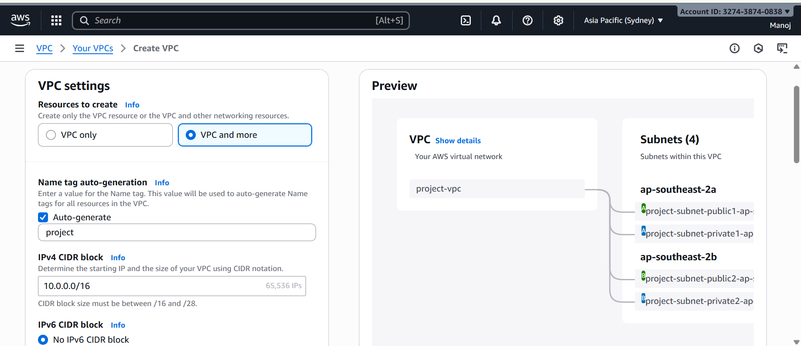

---

#### **Step 2: Rename VPC**

1. After initial creation, navigate to the VPC dashboard
2. Rename the VPC from `project` to `demo` for better clarity

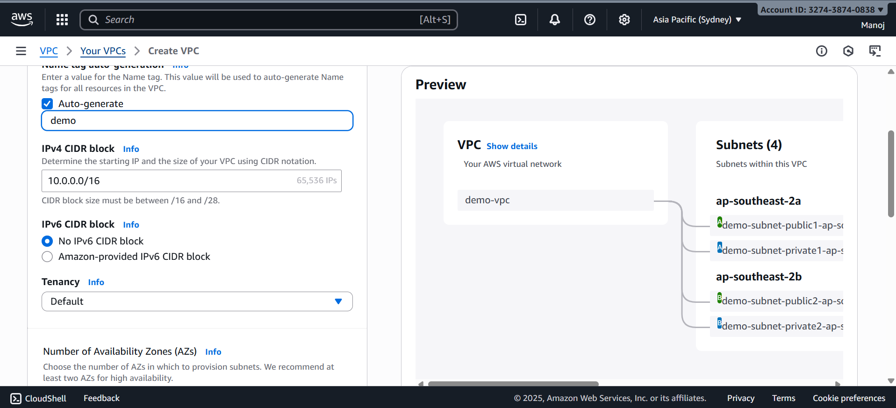

---

#### **Step 3: Configure Subnets**

1. Configure the number of Availability Zones
2. Set the number of public subnets (default: 2)
3. Set the number of private subnets (default: 2)
4. Review the CIDR block configurations
5. Click **"Create VPC"**

**Configuration Details:**
- Public Subnets: For internet-facing resources
- Private Subnets: For backend resources without direct internet access

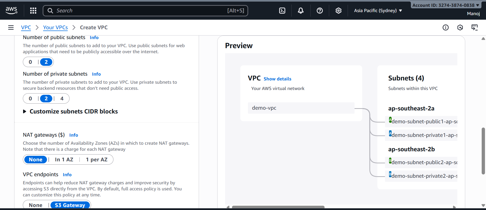

---

#### **Step 4: VPC Components Creation in Progress**

The AWS console will now create all the components:
- VPC
- Subnets (Public and Private)
- Internet Gateway
- Route Tables
- Route Table Associations

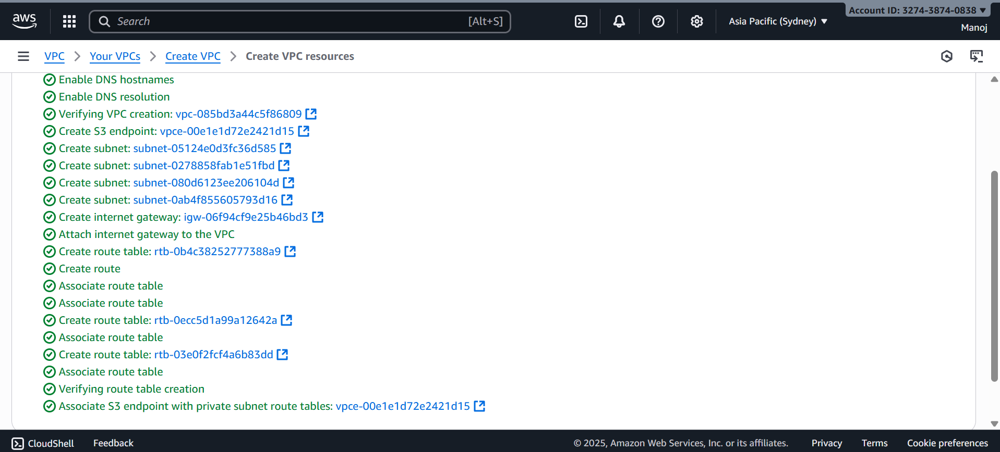

---

#### **Step 5: VPC Creation Complete**

1. Check the creation status - should show "Available"
2. View the complete VPC dashboard with all created resources
3. Verify all components are successfully created

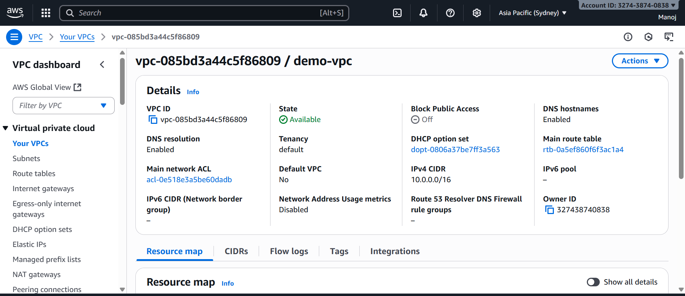

---

#### **Step 6: Resource Map Diagram**

1. Navigate to the **"Resource Map"** tab in VPC console
2. View the visual representation of your VPC architecture
3. This shows the flow and relationship between all components

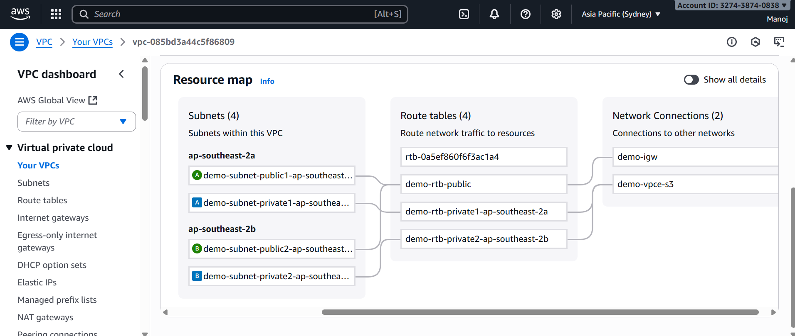

---

#### **Step 7: Network Architecture Flow**

The network flow diagram illustrates:

```
Internet
    ↓
[Internet Gateway]
    ↓
[VPC: demo]
    ↓
[Network ACL] ← Subnet-level security
    ↓
[Public Subnet]
    ↓
[Security Group] ← Instance-level security
    ↓
[EC2 Instance]
```

**Security Layers:**
1. **Network ACL (NACL)** - Stateless firewall at subnet level
2. **Security Group** - Stateful firewall at instance level

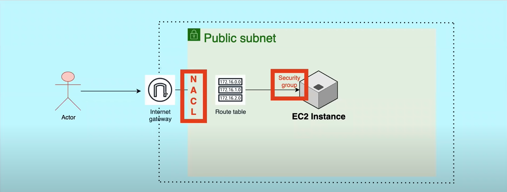

---

### Phase 2: EC2 Instance Setup

#### **Step 8: Create EC2 Instance**

1. Navigate to **EC2 Dashboard**
2. Click **"Launch Instance"**
3. Enter instance name: `demo-instance`

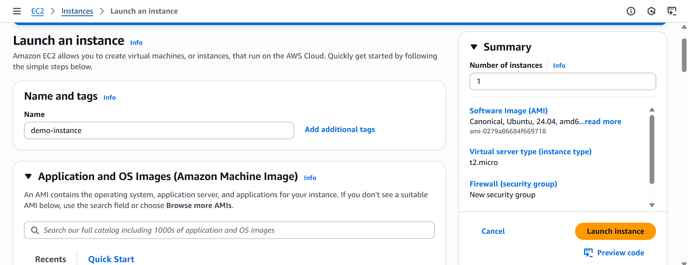

---

#### **Step 9: Select Operating System**

1. Choose **Ubuntu** from the AMI list
2. Select the appropriate Ubuntu version (e.g., Ubuntu Server 22.04 LTS)

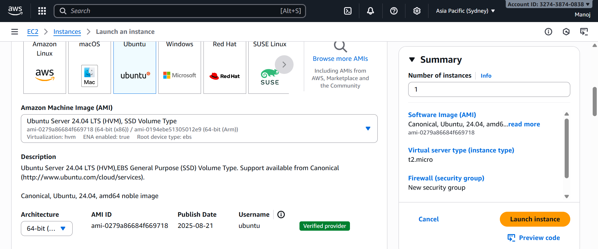

---

#### **Step 10: Configure Instance Type**

1. Select instance type: **t2.micro**
   - Eligible for free tier
   - Sufficient for simple Python application
2. Select your existing key pair (or create new one if needed)

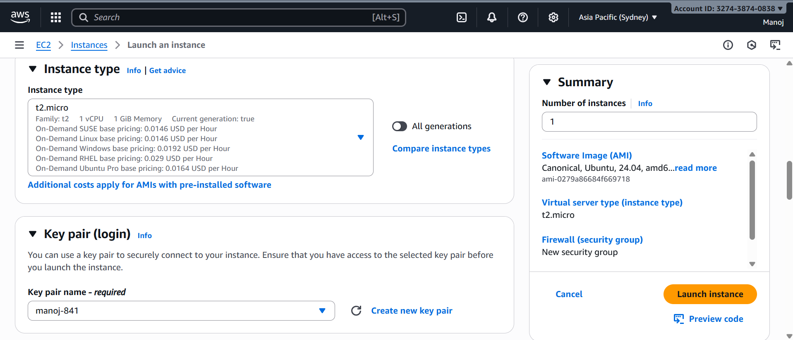

---

#### **Step 11: Network Settings Configuration**

Configure the following network settings:

1. **VPC**: Select `demo` (the VPC we created)
2. **Subnet**: Select one of the **public subnets**
3. **Auto-assign Public IP**: **Enable** (required for internet access)
4. **Security Group**: Create new security group (default rules for now)

**Important:** Keep the security group settings default for now. We'll modify them later.

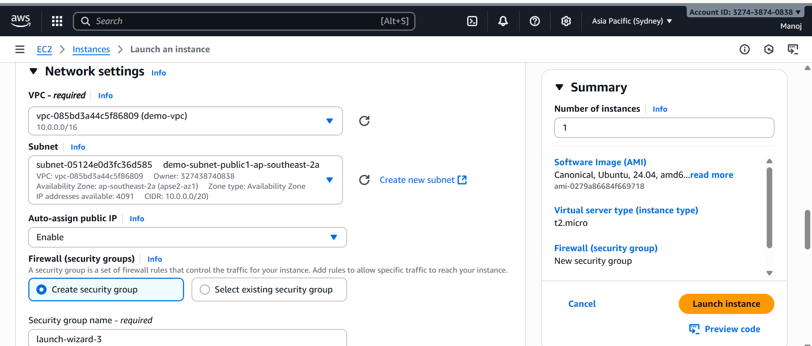

---

#### **Step 12: EC2 Instance Running**

1. Review the instance details
2. Note the **Public IP Address** (e.g., 54.xxx.xxx.xxx)
3. Note the **Private IP Address** (e.g., 10.0.x.x)
4. Verify instance state is **"Running"**

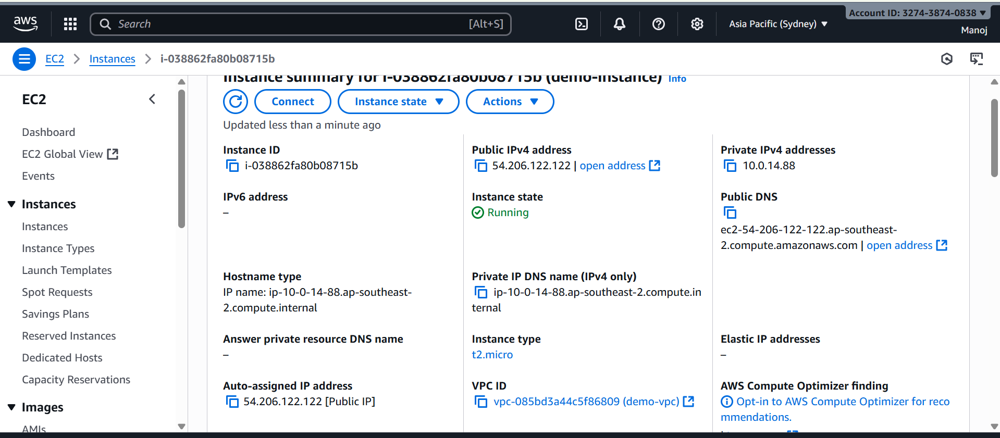

---

### Phase 3: Application Deployment

#### **Step 13: Connect via MobaXterm**

1. Open **MobaXterm**
2. Click on **"Session"** → **"SSH"**
3. Enter the following details:
   - **Remote host**: `<EC2-Public-IP>`
   - **Username**: `ubuntu`
4. Click on **"Advanced SSH settings"**
   - **Use private key**: Browse and select your `.pem` file
5. Click **"OK"** to save the session

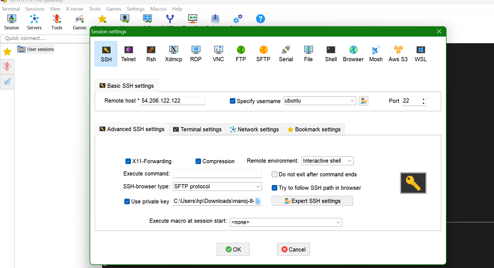

---

#### **Step 14: SSH Connection Established**

1. Open the saved session
2. Accept the security warning (first-time connection)
3. You should now be connected to your EC2 instance

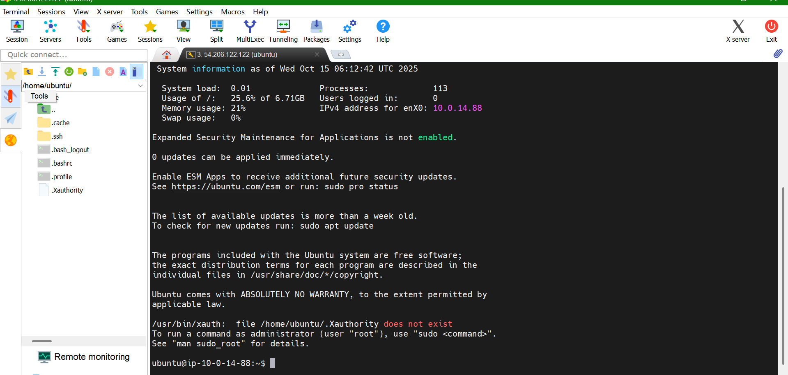

---

#### **Step 15: Verify Python Installation**

1. In the terminal, type:
   ```bash
   python3 --version
   ```
2. Verify Python3 is installed

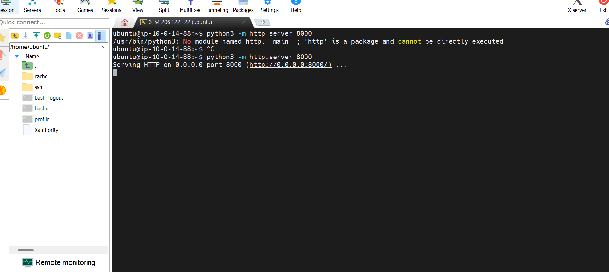

---

#### **Step 16: Start Python HTTP Server**

1. Run the following command:
   ```bash
   python3 -m http.server 8000
   ```
2. The server will start and listen on port 8000
3. You should see output: `Serving HTTP on 0.0.0.0 port 8000...`

**What this does:**
- Starts a simple HTTP server using Python's built-in module
- Serves files from the current directory
- Listens on port 8000 for incoming connections

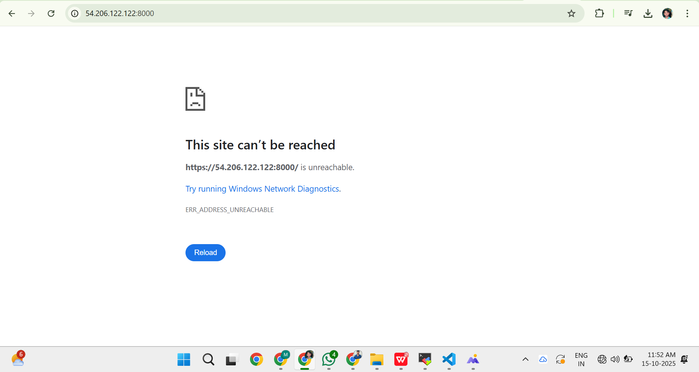

---

#### **Step 17: First Access Attempt (Failed)**

1. Open a web browser
2. Navigate to: `http://<EC2-Public-IP>:8000`
3. **Result**: Connection timeout or unable to connect

**Why it's not working?**
The security group doesn't allow inbound traffic on port 8000 yet.

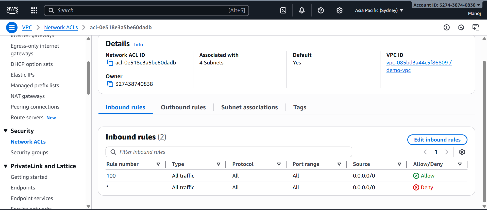

---

### Phase 4: Network ACL Verification

#### **Step 18: Check Network ACL Rules**

1. Navigate to **VPC Console** → **Network ACLs**
2. Select the NACL associated with your public subnet
3. Check **Inbound Rules** and **Outbound Rules**
4. **Observation**: All traffic is allowed by default (Rule 100: Allow ALL)

**Key Finding:**
- NACLs are allowing all traffic
- The issue is NOT with NACLs
- The problem lies with Security Groups

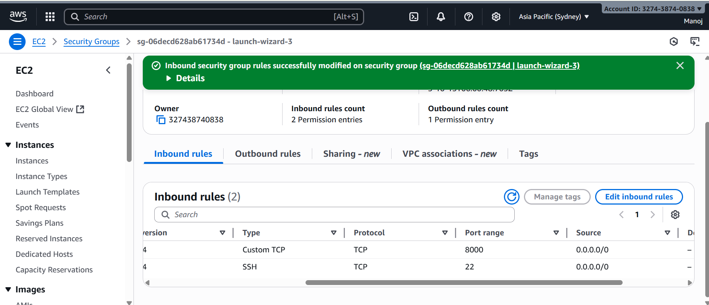

---

### Phase 5: Security Group Configuration

#### **Step 19: Add Port 8000 to Security Group**

1. Navigate to **EC2 Console** → **Security Groups**
2. Select the security group attached to your instance
3. Click **"Edit inbound rules"**
4. Click **"Add rule"**
5. Configure the new rule:
   - **Type**: Custom TCP
   - **Port Range**: 8000
   - **Source**: 0.0.0.0/0 (for testing; restrict in production)
6. Click **"Save rules"**

**Security Note:** In production, restrict the source to specific IP addresses or ranges.

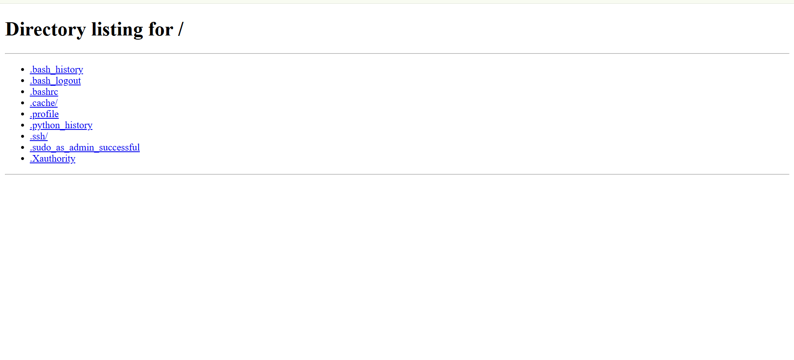

---

#### **Step 20: Application Successfully Deployed**

1. Open browser again
2. Navigate to: `http://<EC2-Public-IP>:8000`
3. **Result**: Application is now accessible!
4. You should see the directory listing or your application interface

**Success!** The application is now deployed and accessible from the internet.

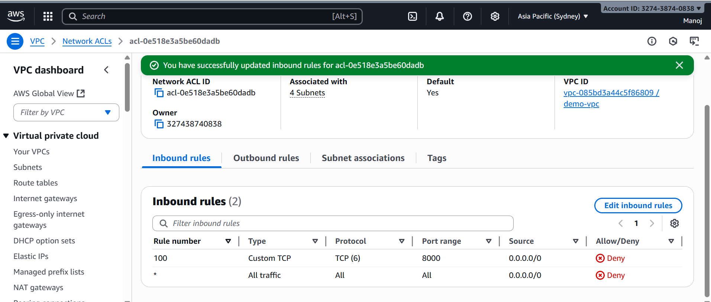

---

### Phase 6: Testing NACL Rules

#### **Step 21: Block All Traffic with NACL**

Let's test NACL functionality by blocking traffic:

1. Go to **VPC Console** → **Network ACLs**
2. Select your subnet's NACL
3. Edit **Inbound Rules**
4. Change Rule 100 from ALLOW to **DENY** for all traffic
5. Save the rules

**Expected Result:** Application should become inaccessible

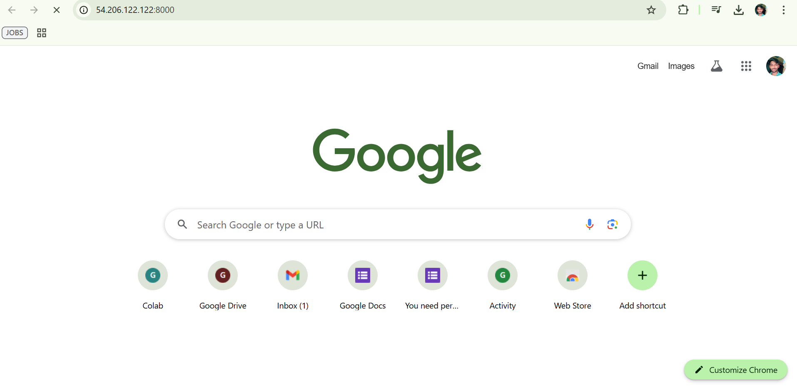

---

#### **Step 22: Verify Application is Blocked**

1. Try accessing: `http://<EC2-Public-IP>:8000`
2. **Result**: Connection timeout or refused
3. **Reason**: NACL is blocking all inbound traffic at the subnet level

**This demonstrates:** NACLs act as the first line of defense before Security Groups.

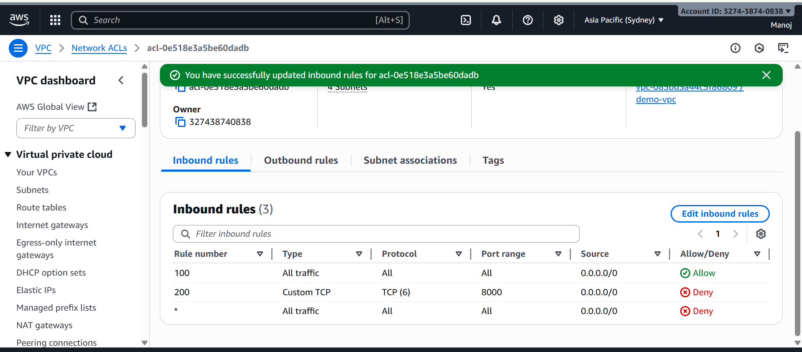

---

#### **Step 23: NACL Rule Priority Testing**

Configure NACL rules to demonstrate rule evaluation order:

1. Edit **Inbound Rules** for the NACL
2. Add **Rule 100**:
   - **Type**: All Traffic
   - **Source**: 0.0.0.0/0
   - **Action**: **ALLOW**
3. Add **Rule 200**:
   - **Type**: Custom TCP
   - **Port**: 8000
   - **Source**: 0.0.0.0/0
   - **Action**: **DENY**
4. Save rules
5. Test the application: `http://<EC2-Public-IP>:8000`

**Result:** Application is accessible!

**Why?**
- NACLs evaluate rules in **ascending order** (lowest rule number first)
- Rule 100 (ALLOW ALL) is evaluated before Rule 200 (DENY 8000)
- Once a rule matches, no further rules are evaluated
- Rule 100 allows the traffic, so Rule 200 never gets checked

**Key Takeaway:** Rule number order is critical in NACLs!

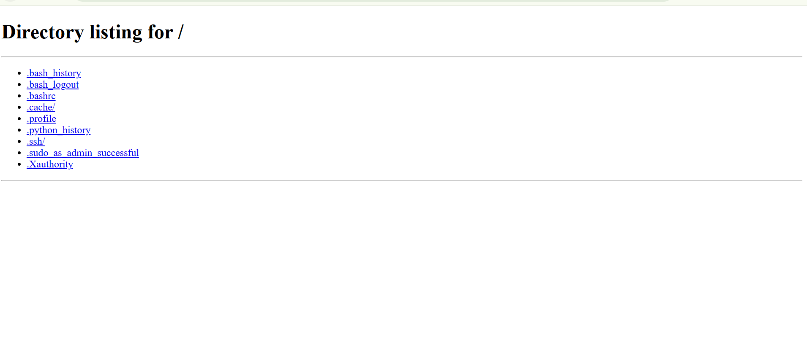

---

## Key Concepts Learned

### 1. **Security Groups vs Network ACLs**

| Feature | Security Group | Network ACL |
|---------|---------------|-------------|
| Level | Instance level | Subnet level |
| State | Stateful | Stateless |
| Rules | Allow rules only | Allow and Deny rules |
| Rule Evaluation | All rules evaluated | Rules evaluated in order |
| Return Traffic | Automatically allowed | Must be explicitly allowed |

### 2. **Defense in Depth**

This project implements two security layers:
- **Layer 1**: Network ACL (subnet-level control)
- **Layer 2**: Security Group (instance-level control)

### 3. **NACL Rule Ordering**

- Rules are evaluated in ascending order (1, 10, 100, 200, etc.)
- First matching rule is applied
- Lower numbered rules take precedence
- Default rule (*) denies all traffic not explicitly allowed

---

## Architecture Diagram

```
                          Internet
                             |
                             |
                    [Internet Gateway]
                             |
                             |
                        [VPC: demo]
                    (CIDR: 10.0.0.0/16)
                             |
                             |
          +------------------+------------------+
          |                                     |
    [Public Subnet]                    [Private Subnet]
    (10.0.1.0/24)                      (10.0.2.0/24)
          |                                     |
    [Network ACL]                               |
    - Rule 100: ALLOW ALL                       |
    - Rule 200: DENY 8000                       |
          |                                     |
    [EC2 Instance]                              |
    - Security Group                            |
      * Port 22: SSH                            |
      * Port 8000: HTTP                         |
    - Python HTTP Server                        |
      * Listening on :8000                      |
          |
    [Application]
```

---

## Troubleshooting Guide

### Issue 1: Cannot Connect to EC2 Instance via SSH

**Solutions:**
- Verify the key pair file permissions: `chmod 400 your-key.pem`
- Check Security Group allows port 22 from your IP
- Verify instance has a public IP address
- Ensure NACL allows SSH traffic (port 22)

### Issue 2: Application Not Accessible on Port 8000

**Solutions:**
- Verify Python server is running: check terminal output
- Check Security Group has inbound rule for port 8000
- Verify NACL allows traffic on port 8000
- Ensure you're using the correct public IP address
- Check if firewall is enabled on EC2: `sudo ufw status`

### Issue 3: Intermittent Connection Issues

**Solutions:**
- Review NACL outbound rules (NACLs are stateless)
- Check if ephemeral ports (1024-65535) are allowed for return traffic
- Verify route table has a route to the Internet Gateway

---

## Security Best Practices

1. **Restrict Security Group Sources**
   - Don't use `0.0.0.0/0` in production
   - Use specific IP addresses or CIDR blocks

2. **Use NACL Deny Rules Wisely**
   - Block known malicious IPs
   - Implement geo-blocking if needed

3. **Principle of Least Privilege**
   - Only open required ports
   - Use specific protocols instead of "All Traffic"

4. **Regular Audits**
   - Review security group and NACL rules regularly
   - Remove unused rules

5. **Multi-Layer Security**
   - Always use both NACLs and Security Groups
   - Consider AWS WAF for application-layer protection

---

## Cleanup

To avoid unnecessary AWS charges, clean up resources:

1. **Terminate EC2 Instance**
   - EC2 Console → Select instance → Instance State → Terminate

2. **Delete VPC**
   - VPC Console → Your VPCs → Select `demo` → Actions → Delete VPC
   - This will delete associated subnets, route tables, and Internet Gateway

3. **Delete Security Groups** (if not deleted with VPC)
   - EC2 Console → Security Groups → Delete unused groups

---

## Conclusion

This project successfully demonstrated:
- ✅ Creating a custom VPC with public and private subnets
- ✅ Deploying an EC2 instance in a public subnet
- ✅ Configuring Security Groups for instance-level security
- ✅ Implementing Network ACLs for subnet-level security
- ✅ Understanding the order of rule evaluation in NACLs
- ✅ Deploying a simple Python HTTP server application
- ✅ Implementing defense-in-depth security strategy

---

## Additional Resources

- [AWS VPC Documentation](https://docs.aws.amazon.com/vpc/)
- [AWS Security Groups](https://docs.aws.amazon.com/vpc/latest/userguide/VPC_SecurityGroups.html)
- [AWS Network ACLs](https://docs.aws.amazon.com/vpc/latest/userguide/vpc-network-acls.html)
- [Python HTTP Server Documentation](https://docs.python.org/3/library/http.server.html)

---

## Author

Gaddam Manoj Kumar Reddy
Date: October 15, 2025  
Project: AWS VPC Deployment with Security

---

## License

This project is for educational purposes.

