# AWS Application Deployment using Public and Private Subnets

## 📋 Project Overview

This project demonstrates the deployment of a scalable, highly-available web application on AWS using a multi-tier architecture. The architecture leverages public and private subnets, load balancing, auto-scaling, and secure access through a bastion host across multiple availability zones.


---

## 🏗️ Architecture Components

### Key Features:
- ✅ **Multi-AZ Deployment**: Resources deployed across two availability zones for high availability
- ✅ **VPC with Public & Private Subnets**: Isolated network architecture with 2 public and 2 private subnets
- ✅ **Application Load Balancer (ALB)**: Public-facing load balancer distributing traffic across instances
- ✅ **Auto Scaling Group**: Automatically adjusts capacity between 1-4 instances based on demand
- ✅ **NAT Gateways**: Two NAT Gateways (one per AZ) enabling private subnet instances to access the internet
- ✅ **Bastion Host**: Secure jump server for accessing private subnet instances
- ✅ **Python Web Application**: Simple HTTP server running on port 8000

---

## 📚 Table of Contents

1. [Prerequisites](#prerequisites)
2. [Step 0: Architecture Design](#step-0-architecture-design)
3. [Step 1: Create VPC](#step-1-create-vpc)
4. [Step 2: Configure Subnets and Availability Zones](#step-2-configure-subnets-and-availability-zones)
5. [Step 3: NAT Gateway Configuration](#step-3-nat-gateway-configuration)
6. [Step 4: VPC Creation Complete](#step-4-vpc-creation-complete)
7. [Step 5: Create Auto Scaling Group](#step-5-create-auto-scaling-group)
8. [Step 6: Launch Template Not Available](#step-6-launch-template-not-available)
9. [Step 7: Create Launch Template](#step-7-create-launch-template)
10. [Step 8: Select AMI and Instance Type](#step-8-select-ami-and-instance-type)
11. [Step 9: Configure Security Group](#step-9-configure-security-group)
12. [Step 10: Launch Template Created](#step-10-launch-template-created)
13. [Step 11: Select Launch Template in ASG](#step-11-select-launch-template-in-asg)
14. [Step 12: Configure Auto Scaling Capacity](#step-12-configure-auto-scaling-capacity)
15. [Step 13: Auto Scaling Group Created](#step-13-auto-scaling-group-created)
16. [Step 14: Create Bastion Host](#step-14-create-bastion-host)
17. [Step 15: Configure Bastion Host](#step-15-configure-bastion-host)
18. [Step 16: Verify Three Instances](#step-16-verify-three-instances)
19. [Step 17: Open MobaXterm](#step-17-open-mobaxterm)
20. [Step 18: Transfer PEM File to Bastion](#step-18-transfer-pem-file-to-bastion)
21. [Step 19: SSH to Bastion Host](#step-19-ssh-to-bastion-host)
22. [Step 20: SSH to Private Instance](#step-20-ssh-to-private-instance)
23. [Step 21: Create HTML Page](#step-21-create-html-page)
24. [Step 22: Start Python Server](#step-22-start-python-server)
25. [Step 23: Deploy on Second Instance](#step-23-deploy-on-second-instance)
26. [Step 24: Create Target Group](#step-24-create-target-group)
27. [Step 25: Register Targets](#step-25-register-targets)
28. [Step 26: Create Load Balancer](#step-26-create-load-balancer)
29. [Step 27: Configure Load Balancer](#step-27-configure-load-balancer)
30. [Step 28: Security Groups and Listener](#step-28-security-groups-and-listener)
31. [Step 29: Load Balancer Created](#step-29-load-balancer-created)
32. [Step 30: Copy DNS Name](#step-30-copy-dns-name)
33. [Step 31: Access Application - Instance 1](#step-31-access-application---instance-1)
34. [Step 32: Access Application - Instance 2](#step-32-access-application---instance-2)
35. [Step 33: Verify in MobaXterm](#step-33-verify-in-mobaxterm)
36. [Step 34: Bastion Host Details](#step-34-bastion-host-details)
37. [Step 35: Final Verification](#step-35-final-verification)
38. [Key Concepts Learned](#key-concepts-learned)
39. [Troubleshooting Guide](#troubleshooting-guide)
40. [Conclusion](#conclusion)
41. [Additional Resources](#additional-resources)
42. [Author](#author)
43. [License](#license)

---

## 📝 Prerequisites

Before starting this project, ensure you have:

### Required:
- **AWS Account** with appropriate IAM permissions
- **SSH Key Pair** (PEM file) for EC2 access
- **MobaXterm** or any SSH client (PuTTY, Terminal, etc.)
- **Web Browser** for testing the application

### Knowledge Requirements:
- Basic understanding of AWS VPC and networking concepts
- Familiarity with EC2 instances
- Understanding of Load Balancers and Auto Scaling Groups
- Basic Linux command-line knowledge
- Understanding of SSH and secure connections

---

## STEP 0: Architecture Design

**Objective**: Understand the complete architecture before deployment.

This step shows the complete architecture diagram with all components that will be deployed throughout this project.

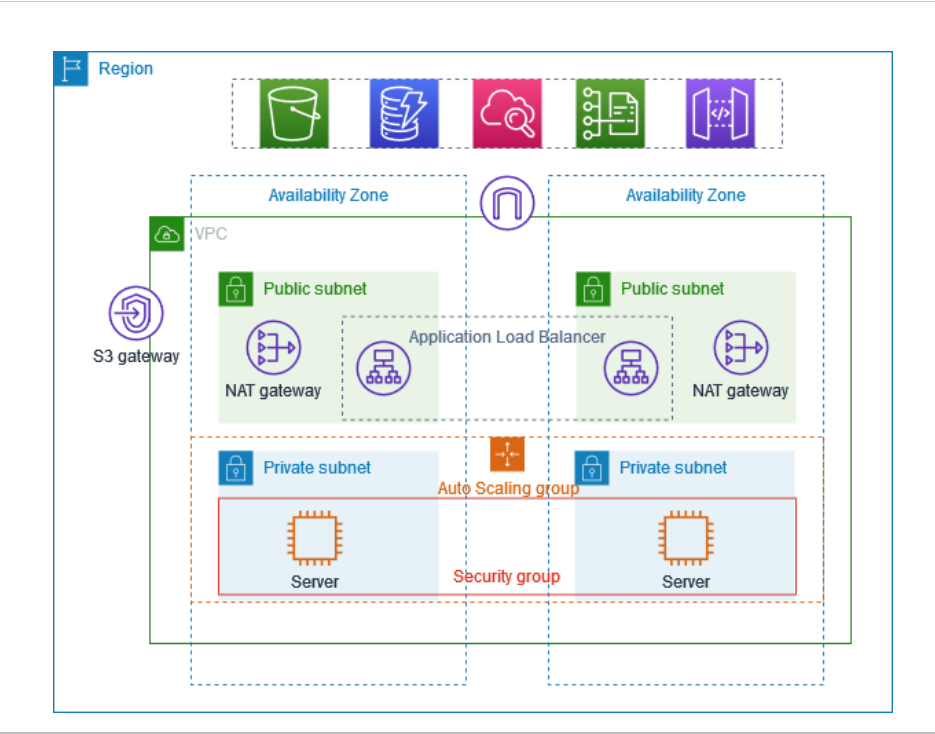

### Architecture Components:
- 🔷 **VPC** with custom CIDR block (10.0.0.0/16)
- 🔷 **Two Availability Zones** (AZ1 and AZ2) for high availability
- 🔷 **Two Public Subnets** (one per AZ) - for ALB and Bastion Host
- 🔷 **Two Private Subnets** (one per AZ) - for application instances
- 🔷 **Internet Gateway** - enables internet connectivity
- 🔷 **Two NAT Gateways** (one per AZ) - for private subnet outbound traffic
- 🔷 **Application Load Balancer** - distributes traffic across instances
- 🔷 **Auto Scaling Group** - manages EC2 instances (1-4 instances)
- 🔷 **Bastion Host** - secure access point to private instances
- 🔷 **Route Tables** - controls network traffic routing
- 🔷 **Security Groups** - acts as virtual firewalls

### Traffic Flow:
1. User accesses application via Load Balancer DNS
2. ALB receives traffic on port 80
3. ALB forwards traffic to healthy instances on port 8000
4. Instances in private subnets process requests
5. Responses return through the same path

**Note**: VPC endpoints are NOT used in this architecture.

---

## STEP 1: Create VPC

**Objective**: Create a custom VPC with all necessary networking components.

In this step, we create a VPC that will host all our resources. Navigate to AWS Console → VPC Dashboard → Create VPC.

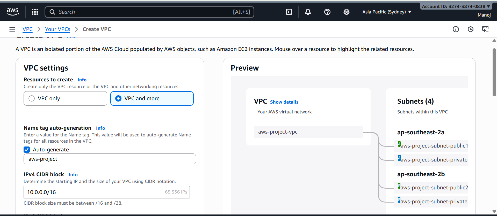

### Configuration:
1. Open AWS Management Console
2. Navigate to **VPC Dashboard**
3. Click **Create VPC**
4. Select **VPC and more** (this creates VPC with subnets, route tables, NAT gateways automatically)
5. **Name tag**: `aws-project`
6. **IPv4 CIDR block**: 10.0.0.0/16 (default)
7. Change from default VPC to custom configuration

### Why VPC?
- Provides network isolation for your resources
- Enables custom IP addressing
- Offers complete control over network configuration
- Enhances security through network segmentation

---

## STEP 2: Configure Subnets and Availability Zones

**Objective**: Set up multiple subnets across different availability zones for high availability.

Configure the subnet architecture across two availability zones to ensure high availability.

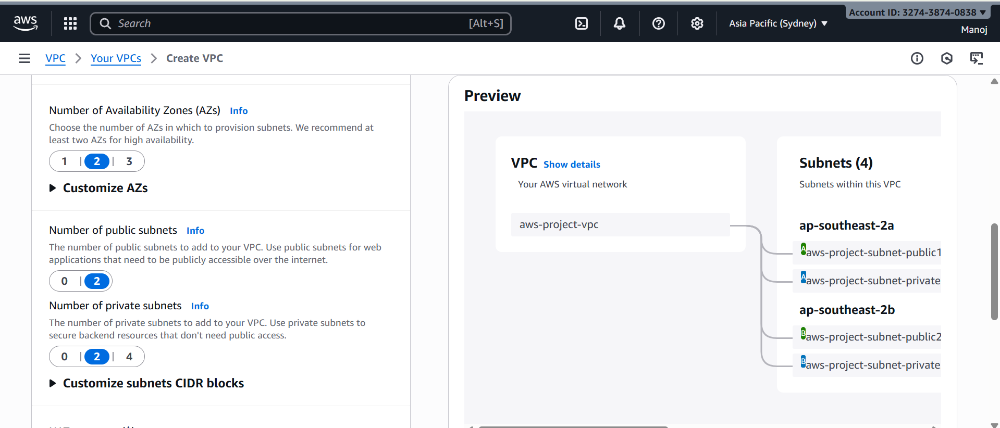

### Configuration:
- **Number of Availability Zones**: 2
- **Number of Public Subnets**: 2 (one in each AZ)
- **Number of Private Subnets**: 2 (one in each AZ)
- **Customize subnet CIDR blocks**: Leave as default or customize if needed

### Subnet Details:
| Subnet Name | Type | Availability Zone | CIDR Block | Purpose |
|-------------|------|-------------------|------------|---------|
| Public Subnet 1 | Public | AZ-1 | 10.0.0.0/24 | ALB, Bastion |
| Public Subnet 2 | Public | AZ-2 | 10.0.1.0/24 | ALB, NAT Gateway |
| Private Subnet 1 | Private | AZ-1 | 10.0.128.0/24 | App Instances |
| Private Subnet 2 | Private | AZ-2 | 10.0.129.0/24 | App Instances |

### Benefits of Multi-AZ:
- High availability and fault tolerance
- Automatic failover capabilities
- Better disaster recovery
- Improved application uptime

---

## STEP 3: NAT Gateway Configuration

**Objective**: Enable private subnet instances to access the internet for updates and patches.

Configure NAT Gateways to allow outbound internet access for instances in private subnets.

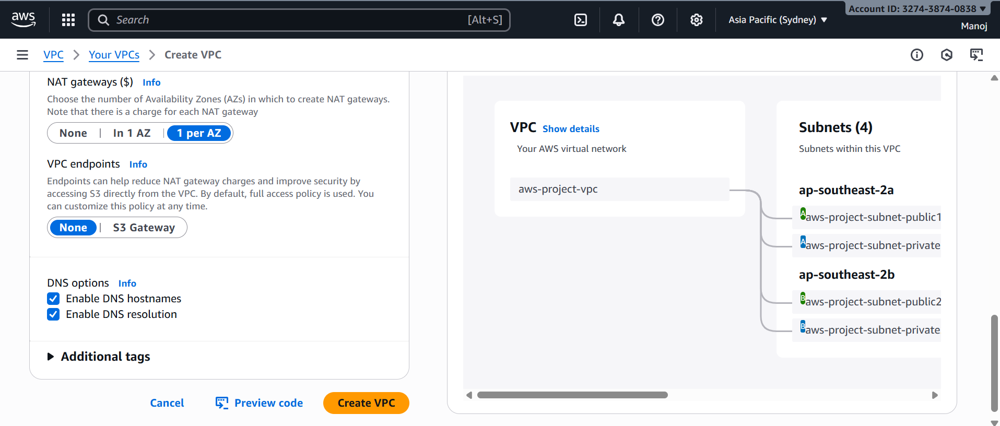

### Configuration:
- **NAT Gateways**: **1 per AZ** (total: 2 NAT Gateways)
- **VPC Endpoints**: **None** (not required for this project)

### NAT Gateway Details:
- **Location**: Deployed in public subnets
- **Purpose**: Allows outbound internet access from private subnets
- **Elastic IP**: Each NAT Gateway gets an Elastic IP automatically
- **High Availability**: One per AZ ensures redundancy

### Why NAT Gateways?
- ✅ Private instances can download updates and patches
- ✅ Prevents direct inbound internet access to private instances
- ✅ Each AZ has its own NAT Gateway for high availability
- ✅ Automatic failover within the AZ

**Note**: NAT Gateways incur hourly charges and data processing fees.

---

## STEP 4: VPC Creation Complete

**Objective**: Verify all VPC resources are created successfully.

After clicking **Create VPC**, AWS provisions all resources automatically (takes 2-3 minutes). This step shows the VPC resource map with complete configuration.

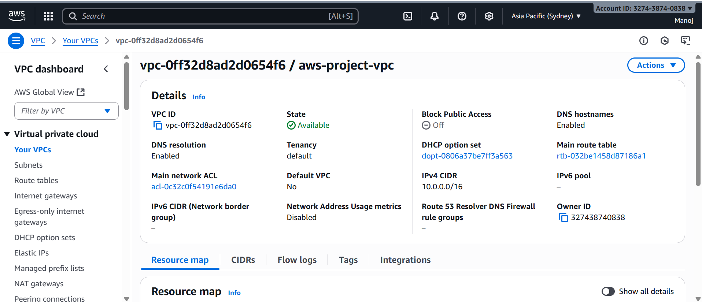

### Created Resources:
- ✅ VPC with custom CIDR block (10.0.0.0/16)
- ✅ 4 Subnets (2 public, 2 private)
- ✅ Internet Gateway (attached to VPC)
- ✅ 2 NAT Gateways (one per public subnet)
- ✅ Route Tables (main and custom)
- ✅ Network ACLs (default)
- ✅ Security Groups (default)

### Verification Checklist:
- [ ] VPC status: Available
- [ ] Internet Gateway: Attached
- [ ] NAT Gateways: Available (2)
- [ ] Subnets: Created (4)
- [ ] Route Tables: Configured properly

**Resource Map**: The resource map visually shows all components and their relationships within the VPC.

---

## STEP 5: Create Auto Scaling Group

**Objective**: Begin creating an Auto Scaling Group to manage EC2 instances dynamically.

Navigate to EC2 Dashboard and start creating the Auto Scaling Group that will manage application instances.

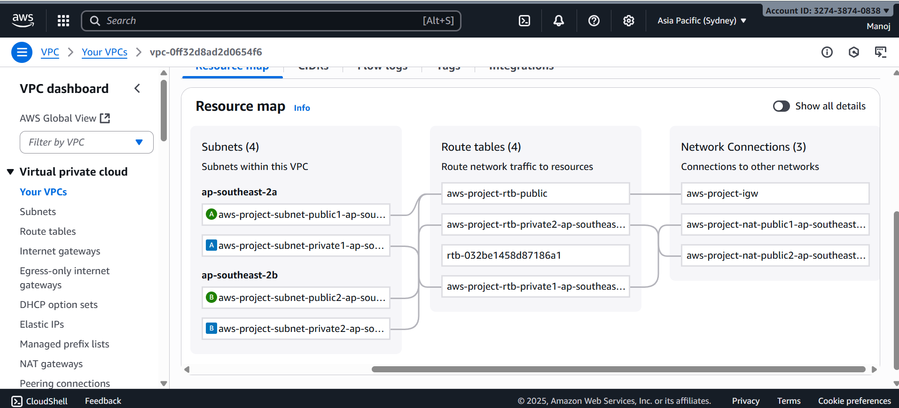

### Navigation:
1. Open AWS Console
2. Go to **EC2 Dashboard**
3. Click **Auto Scaling Groups** (left sidebar)
4. Click **Create Auto Scaling group**

### Configuration:
- **Auto Scaling group name**: `aws-project`
- **Description**: Optional

### What is Auto Scaling?
Auto Scaling automatically adjusts the number of EC2 instances based on:
- Traffic load and demand
- CPU utilization metrics
- Custom CloudWatch metrics
- Time-based schedules

This ensures optimal performance while minimizing costs.

---

## STEP 6: Launch Template Not Available

**Objective**: Identify that a launch template needs to be created first.

At this point, you don't have a launch template yet. The Auto Scaling Group requires a launch template to know what type of instances to create.

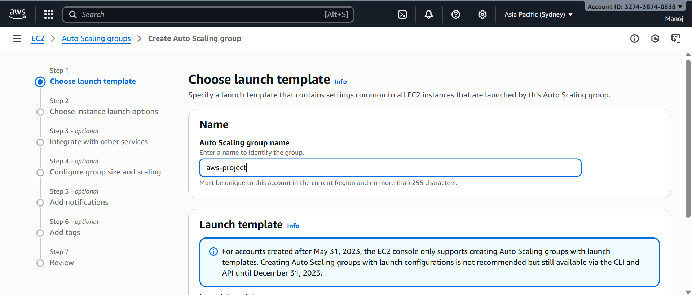

### What is a Launch Template?
A launch template defines the configuration for EC2 instances:
- AMI (Operating System)
- Instance type (t2.micro, t2.small, etc.)
- Key pair for SSH access
- Security groups (firewall rules)
- Storage configuration
- Network settings

### Next Action:
Click **Create a launch template** link or navigate to Launch Templates section from EC2 Dashboard.

---

## STEP 7: Create Launch Template

**Objective**: Define the configuration template for Auto Scaling instances.

Create a launch template that specifies the configuration for all instances launched by the Auto Scaling Group.

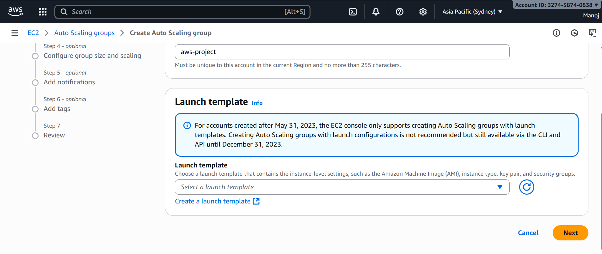

### Navigation:
EC2 Dashboard → Launch Templates → Create launch template

### Configuration:
- **Launch template name**: `aws-project-launch-template`
- **Template version description**: "Launch template for auto-scaling web application instances in private subnets"
- **Auto Scaling guidance**: ☑️ Check this box

### Purpose:
This template will be used by the Auto Scaling Group to launch new instances with consistent configuration across all instances.

---

## STEP 8: Select AMI and Instance Type

**Objective**: Choose the operating system and instance specifications.

Select the AMI (operating system), instance type, and key pair for SSH access.

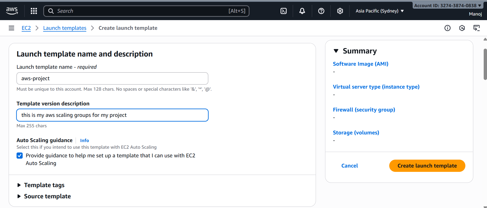

### Configuration:
**Application and OS Images (AMI)**:
- Select **Ubuntu Server** (latest LTS version)
- **Ubuntu Server 22.04 LTS** or **24.04 LTS** recommended
- **Architecture**: 64-bit (x86)

**Instance Type**:
- Select **t2.micro** (Free tier eligible)
- **vCPUs**: 1
- **Memory**: 1 GiB

**Key Pair (login)**:
- Select existing key pair: `manoj-841` (or your key pair name)
- **Important**: Save this PEM file securely on your local machine

### Why Ubuntu?
- Free and open-source
- Python3 pre-installed by default
- Large community support
- Lightweight and efficient

---

## STEP 9: Configure Security Group

**Objective**: Configure firewall rules for secure instance access.

Create a security group with necessary inbound rules for SSH access and application traffic.

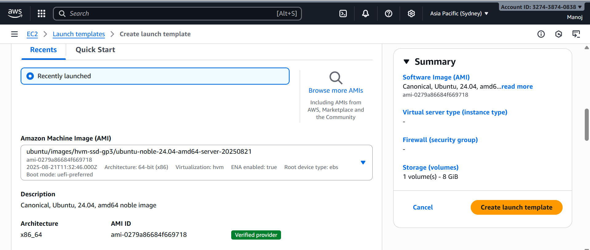

### Configuration:
**Network Settings**:
- **Subnet**: Don't include in launch template (will be configured in ASG)
- **Firewall (security groups)**: Create security group

**Security Group Details**:
- **Security group name**: `aws-project-sg`
- **Description**: "Security group for web application instances"
- **VPC**: Select `aws-project` VPC

### Inbound Rules:
**Rule 1 - SSH Access**:
- **Type**: SSH
- **Protocol**: TCP
- **Port**: 22
- **Source**: 0.0.0.0/0 (Anywhere) or your IP for better security

**Rule 2 - Application Access**:
- **Type**: Custom TCP
- **Protocol**: TCP
- **Port**: 8000
- **Source**: 0.0.0.0/0 (Anywhere)

### Security Best Practices:
- ⚠️ For production, restrict SSH to specific IP addresses
- ⚠️ Port 8000 should ideally only allow traffic from Load Balancer security group
- ⚠️ Consider using AWS Systems Manager Session Manager instead of SSH

---

## STEP 10: Launch Template Created

**Objective**: Finalize and verify launch template creation.

Complete the launch template creation and verify it's created successfully.

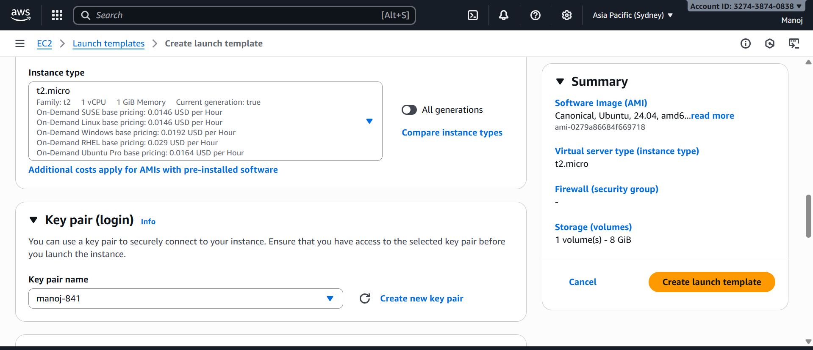

### Actions:
1. Review all configurations
2. Click **Create launch template** button
3. Wait for success confirmation

### Success Indicators:
- ✅ Green success banner appears
- ✅ Template ID generated (lt-xxxxxxxxxxxxxxxxx)
- ✅ Template name: `aws-project-launch-template`
- ✅ Status: Available

Now you can return to Auto Scaling Group creation and select this template.

---

## STEP 11: Select Launch Template in ASG

**Objective**: Link the launch template to the Auto Scaling Group.

Return to Auto Scaling Group creation and select the newly created launch template.

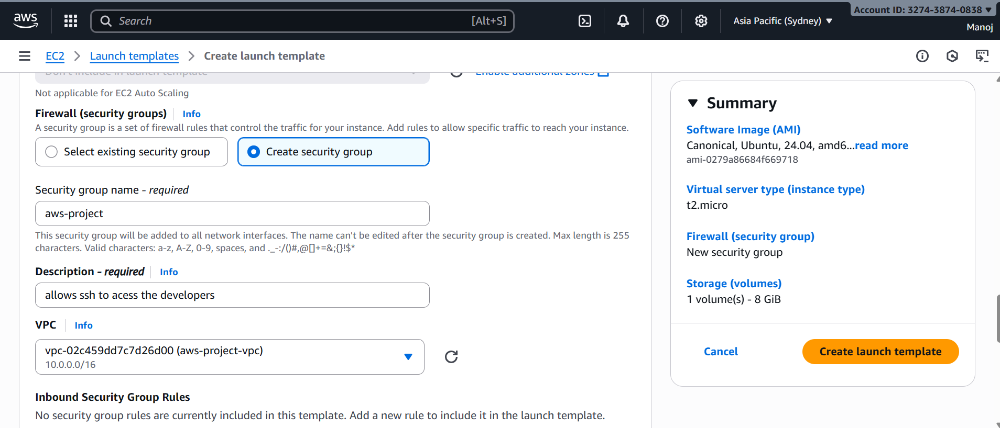

### Actions:
1. Return to **Auto Scaling Groups** creation page (or continue from where you left)
2. Refresh the launch template dropdown if needed
3. Select **aws-project-launch-template**
4. Choose **Latest** version or specific version
5. Click **Next**

### Template Versioning:
- **Default**: Uses latest version automatically
- **Latest**: Always uses the most recent version
- **Specific Version**: Locks to a particular version number

Using "Latest" ensures that any updates to the template are automatically used for new instances.

---

## STEP 12: Configure Auto Scaling Capacity

**Objective**: Define scaling parameters and network placement for instances.

Configure the Auto Scaling Group capacity settings and select the private subnets where instances will be launched.

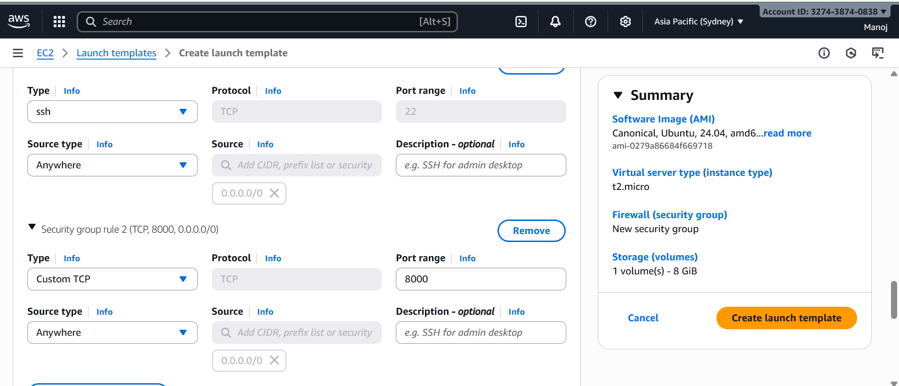

### Group Size Configuration:
- **Desired capacity**: 2 instances
- **Minimum capacity**: 1 instance
- **Maximum capacity**: 4 instances

### Scaling Behavior:
- Auto Scaling maintains 2 running instances normally
- Scales down to minimum 1 instance during low traffic
- Scales up to maximum 4 instances during high traffic
- Gradual scaling based on defined policies

### Network Configuration:
- **VPC**: `aws-project`
- **Availability Zones and subnets**: Select **both private subnets**
  - ✅ Private Subnet 1 (AZ-1)
  - ✅ Private Subnet 2 (AZ-2)

### Important:
- ⚠️ Always select **private subnets** for application instances
- ⚠️ Ensures instances are not directly accessible from internet
- ⚠️ Select both subnets for multi-AZ deployment

### Additional Settings:
- **Health check type**: EC2 (default)
- **Health check grace period**: 300 seconds
- **Enable group metrics collection**: Yes (recommended)

Click **Next** through remaining steps, then click **Create Auto Scaling group**.

---

## STEP 13: Auto Scaling Group Created

**Objective**: Verify Auto Scaling Group creation and instance launch.

After creating the Auto Scaling Group, verify that instances are automatically launched in the private subnets.

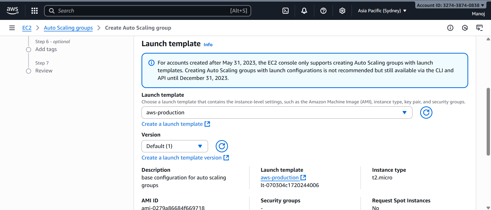

### Verification Steps:
1. Go to **EC2 → Auto Scaling Groups**
2. Verify `aws-project` ASG is created
3. Go to **EC2 → Instances**
4. Verify 2 instances are running

### Instance Details:
- **Count**: 2 instances (as per desired capacity)
- **Names**: Auto-generated by ASG
- **Subnet**: Private Subnet 1 or Private Subnet 2
- **Public IP**: None (private instances)
- **Private IP**: 10.0.128.x or 10.0.129.x
- **Status**: Running
- **Security Group**: `aws-project-sg`

### Success Indicators:
- ✅ Auto Scaling Group status: Active
- ✅ Desired capacity = Running instances = 2
- ✅ Instances distributed across both AZs
- ✅ All status checks passing

**Wait Time**: Allow 2-3 minutes for instances to fully initialize and pass status checks.

---

## STEP 14: Create Bastion Host

**Objective**: Deploy a bastion host for secure SSH access to private instances.

Create a bastion host (jump server) that will serve as a secure gateway to access instances in private subnets.

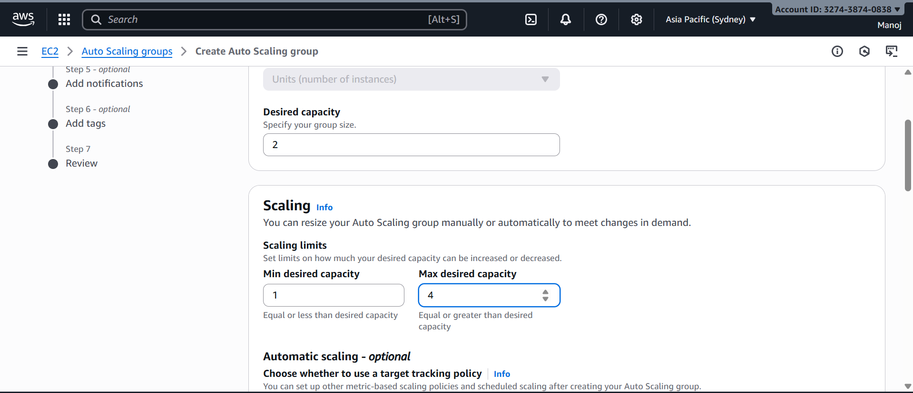

### What is a Bastion Host?
A bastion host (jump server) is a secure gateway that:
- Provides controlled SSH access to private instances
- Sits in a public subnet with a public IP
- Acts as a security checkpoint
- Reduces attack surface by limiting entry points

### Navigation:
EC2 Dashboard → Instances → Launch Instance

### Configuration:
- **Instance Name**: `bastion-host`
- **Purpose**: Secure SSH gateway to private subnet instances

This instance will be launched in a public subnet with a public IP address.

---

## STEP 15: Configure Bastion Host

**Objective**: Configure the bastion host with proper networking and security settings.

Configure the bastion host instance with Ubuntu, t2.micro instance type, and critical network settings including public IP.

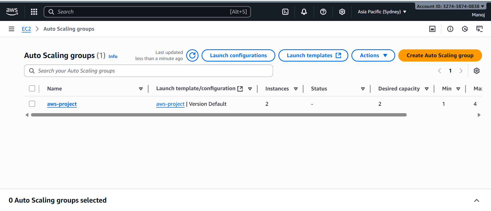

### Configuration:
**AMI Selection**:
- **Operating System**: Ubuntu Server (same as application instances)
- **Version**: Ubuntu Server 22.04 LTS or 24.04 LTS

**Instance Type**:
- **Type**: t2.micro (Free tier eligible)

**Key Pair**:
- **Key pair**: `manoj-841` (same key pair used for application instances)

### Network Settings (Critical):
- **VPC**: `aws-project`
- **Subnet**: Select a **public subnet** ⚠️ (Public Subnet 1 or Public Subnet 2)
- **Auto-assign Public IP**: **Enable** ✅ (Critical!)

### Firewall (Security Group):
- **Create new security group** or use existing
- **Security group name**: `bastion-sg`

**Inbound Rules**:
- **Type**: SSH
- **Port**: 22
- **Source**: Your IP address (recommended) or 0.0.0.0/0

### Why Public IP is Required:
- Bastion host must be accessible from the internet
- Acts as the entry point to your private network
- Public IP enables direct SSH connection from your computer

### Storage:
- **Size**: 8 GiB (default)
- **Type**: gp2 or gp3

Click **Launch Instance**.

---

## STEP 16: Verify Three Instances

**Objective**: Confirm all instances are running correctly.

Verify that you now have three instances running: one bastion host and two application instances.

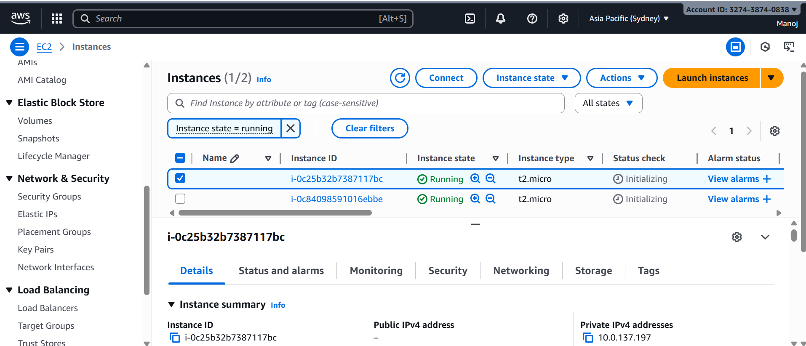

### Instance Inventory:
| Instance Name | Subnet Type | Public IP | Private IP | Purpose |
|---------------|-------------|-----------|------------|---------|
| bastion-host | Public | Yes (e.g., 54.x.x.x) | 10.0.0.x | SSH Gateway |
| ASG Instance 1 | Private | No | 10.0.128.x | App Server |
| ASG Instance 2 | Private | No | 10.0.129.x | App Server |

### Verification Checklist:
- [ ] All 3 instances showing "Running" state
- [ ] Bastion host has public IP address
- [ ] Application instances have NO public IPs
- [ ] All instances in correct subnets (1 public, 2 private)
- [ ] All status checks passing (wait 2-3 minutes if needed)

**Note the bastion host's public IP address** - you'll need it in the next steps.

---

## STEP 17: Open MobaXterm

**Objective**: Prepare MobaXterm for SSH connections.

Open MobaXterm application to begin the process of connecting to the bastion host.

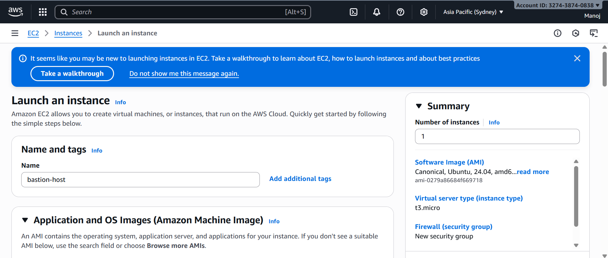

### Prerequisites:
- MobaXterm installed on your local machine
- PEM file (`manoj-841.pem`) saved locally
- Bastion host public IP address ready

### MobaXterm Features:
- Built-in SSH client
- SFTP file browser
- Multi-tab interface
- X11 forwarding support
- Session management

You'll see the local terminal/home screen when you open MobaXterm.

---

## STEP 18: Transfer PEM File to Bastion

**Objective**: Copy your SSH key to the bastion host for accessing private instances.

Transfer the PEM file from your local machine to the bastion host using SCP (Secure Copy Protocol).

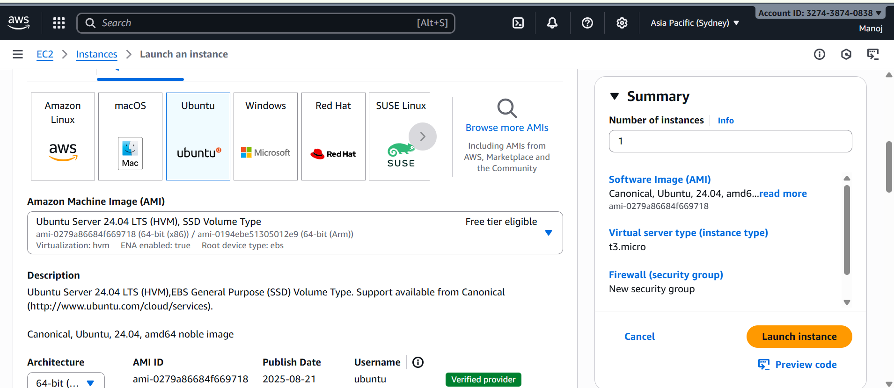

### Why Transfer PEM File?
- Private instances don't have public IPs
- You need to SSH from bastion → private instance
- PEM file must be on bastion host to authenticate

### Command (Linux/Mac/MobaXterm):
```bash
scp -i /path/to/manoj-841.pem /path/to/manoj-841.pem ubuntu@<bastion-public-ip>:~/
```

### Windows Example:
```bash
scp -i "C:\Users\YourName\Downloads\manoj-841.pem" "C:\Users\YourName\Downloads\manoj-841.pem" ubuntu@54.123.45.67:~/
```

### Command Breakdown:
- `scp`: Secure copy protocol command
- `-i /path/to/manoj-841.pem`: Your local PEM file for authentication
- `/path/to/manoj-841.pem`: File to transfer
- `ubuntu@<bastion-public-ip>`: Destination user and host
- `:~/`: Home directory on bastion host

### Replace:
- `/path/to/manoj-841.pem` → Actual path to your PEM file
- `<bastion-public-ip>` → Bastion host's public IP from EC2 console

### Expected Output:
```
manoj-841.pem                           100% 1704    45.2KB/s   00:00
```

---

## STEP 19: SSH to Bastion Host

**Objective**: Connect to the bastion host via SSH.

Establish SSH connection to the bastion host from your local machine.

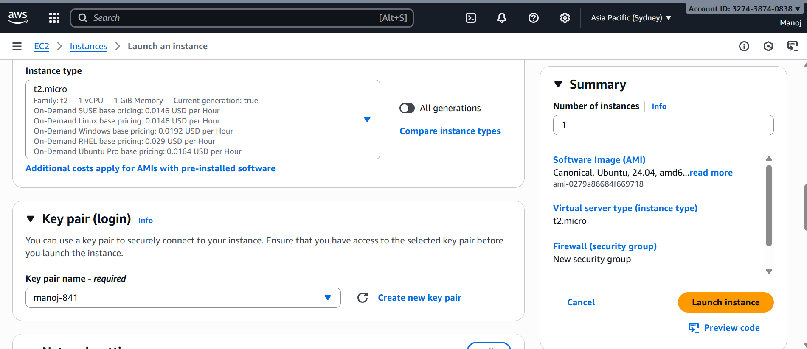

### Command:
```bash
ssh -i /path/to/manoj-841.pem ubuntu@<bastion-public-ip>
```

### Example:
```bash
ssh -i ~/Downloads/manoj-841.pem ubuntu@54.123.45.67
```

### Expected Welcome Message:
```
Welcome to Ubuntu 22.04.x LTS (GNU/Linux 5.x.x-aws x86_64)

 * Documentation:  https://help.ubuntu.com
 * Management:     https://landscape.canonical.com
 * Support:        https://ubuntu.com/advantage

ubuntu@ip-10-0-0-x:~$
```

### Success Indicator:
You should see the Ubuntu welcome message and command prompt showing `ubuntu@ip-10-0-0-x:~$`

### Troubleshooting:
- Verify security group allows SSH from your IP
- Check bastion host is running
- Ensure PEM file permissions: `chmod 400 manoj-841.pem`
- Verify public IP address is correct

---

## STEP 20: SSH to Private Instance

**Objective**: Access private subnet instance through the bastion host.

From the bastion host, connect to the first private instance using its private IP address.

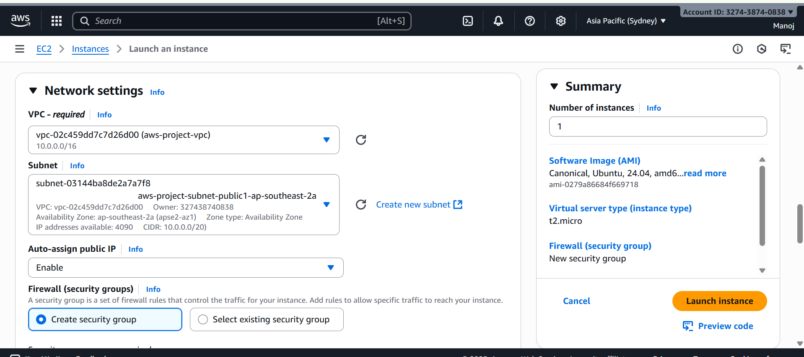

### Commands (on Bastion Host):

**Step 1 - Set PEM file permissions**:
```bash
chmod 400 manoj-841.pem
```

**Step 2 - Verify PEM file**:
```bash
ls -la manoj-841.pem
```

Expected output:
```
-r-------- 1 ubuntu ubuntu 1704 Oct 21 10:30 manoj-841.pem
```

**Step 3 - Get private instance IP**:
- Go to EC2 Console on your computer
- Select first private instance
- Copy its **Private IPv4 address** (e.g., 10.0.128.45)

**Step 4 - SSH to private instance**:
```bash
ssh -i manoj-841.pem ubuntu@<private-instance-1-ip>
```

### Example:
```bash
ssh -i manoj-841.pem ubuntu@10.0.128.45
```

### Success Indicator:
```
ubuntu@ip-10-0-128-45:~$
```

### Important:
- ⚠️ Use **private IP address**, NOT public IP
- ⚠️ Private instances don't have public IPs
- ⚠️ Connection path: Your PC → Bastion Host → Private Instance

---

## STEP 21: Create HTML Page

**Objective**: Create a simple HTML page for the web application on Instance 1.

Create a simple HTML file that will be served by the Python HTTP server.

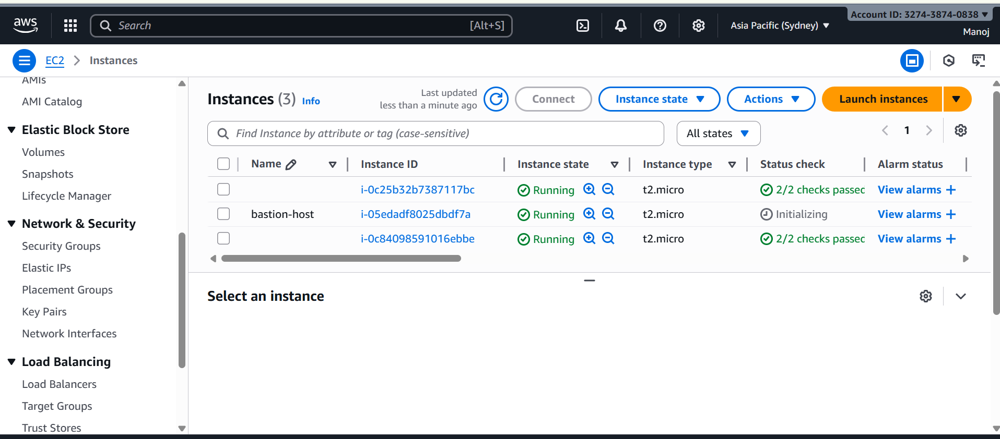

### Commands (on Private Instance 1):

**Step 1 - Verify Python3**:
```bash
python3 --version
```

**Step 2 - Create HTML file**:
```bash
nano index.html
```

**Step 3 - Paste this simple HTML**:
```html
<!DOCTYPE html>
<html>
<head>
    <title>AWS Project</title>
</head>
<body>
    <h1>Welcome to AWS Project!</h1>
    <p>This is Private Instance 1</p>
</body>
</html>
```

**Step 4 - Save the file**:
- Press `Ctrl + X`
- Press `Y` (yes to save)
- Press `Enter` (confirm filename)

**Step 5 - Verify file**:
```bash
cat index.html
```

This creates a simple two-line HTML page that clearly identifies Instance 1.

---

## STEP 22: Start Python Server

**Objective**: Launch the web application using Python's HTTP server on Instance 1.

Start the Python HTTP server to serve the HTML page on port 8000.

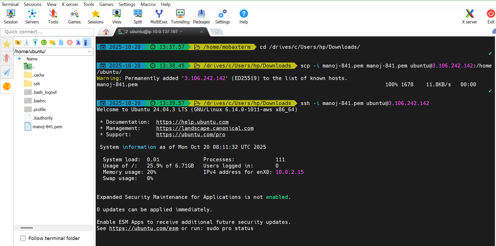

### Command:
```bash
python3 -m http.server 8000
```

### Expected Output:
```
Serving HTTP on 0.0.0.0 port 8000 (http://0.0.0.0:8000/) ...
```

### What This Does:
- Starts a web server on port 8000
- Serves the `index.html` file
- Listens on all network interfaces (0.0.0.0)
- Stays running until stopped (Ctrl+C)

### Important:
- ⚠️ **Keep this terminal window open**
- ⚠️ Server stops if you close the terminal or press Ctrl+C
- ⚠️ Don't close this SSH session

The server is now running and waiting for requests on port 8000!

---

## STEP 23: Deploy on Second Instance

**Objective**: Deploy application on the second private instance with different content.

Now deploy the application on the second private instance using a new SSH session.

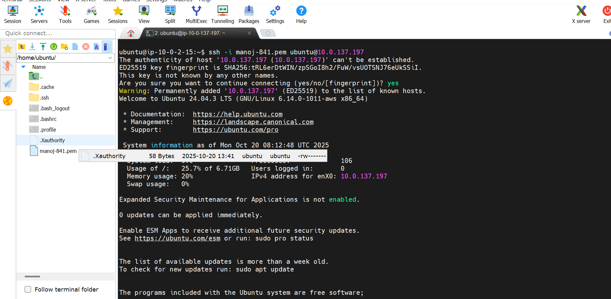

### Process:
**Open a new terminal/session** in MobaXterm (don't close the first one!)

**Repeat these steps for Instance 2**:

1. **SSH to bastion host** (from your local machine):
```bash
ssh -i /path/to/manoj-841.pem ubuntu@<bastion-public-ip>
```

2. **Get private instance 2 IP**:
   - Go to EC2 Console
   - Select second private instance
   - Copy its Private IPv4 address

3. **SSH to private instance 2**:
```bash
chmod 400 manoj-841.pem
ssh -i manoj-841.pem ubuntu@<private-instance-2-ip>
```

4. **Create HTML file with different content**:
```bash
nano index.html
```

5. **Paste this HTML** (notice "Instance 2"):
```html
<!DOCTYPE html>
<html>
<head>
    <title>AWS Project</title>
</head>
<body>
    <h1>Welcome to AWS Project!</h1>
    <p>This is Private Instance 2</p>
</body>
</html>
```

6. **Save**: Ctrl+X, Y, Enter

7. **Start server**:
```bash
python3 -m http.server 8000
```

### Why Different Content?
- 🎯 Demonstrates load balancing visually
- 🎯 Each refresh may show different content
- 🎯 Proves traffic distribution between instances
- 🎯 Easy to identify which instance serves the request

### Current Status:
- ✅ Instance 1: Running server with "Private Instance 1"
- ✅ Instance 2: Running server with "Private Instance 2"
- ⏳ Next: Create load balancer to distribute traffic

---

## STEP 24: Create Target Group

**Objective**: Create a target group to manage the application instances.

A target group routes requests to registered targets (our EC2 instances) and performs health checks.

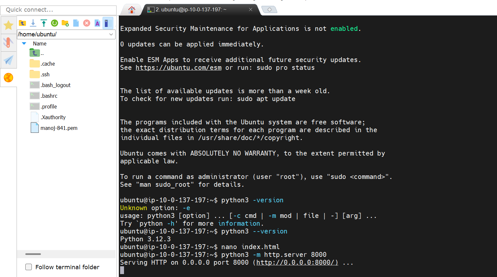

### Navigation:
EC2 Dashboard → Target Groups → Create target group

### Configuration:
- **Choose a target type**: Instances
- **Target group name**: `aws-project-tg`
- **Protocol**: HTTP
- **Port**: 8000
- **VPC**: `aws-project`

### Health Check Settings:
- **Health check protocol**: HTTP
- **Health check path**: `/`
- **Advanced settings**:
  - Healthy threshold: 2
  - Unhealthy threshold: 2
  - Timeout: 5 seconds
  - Interval: 30 seconds
  - Success codes: 200

### Why Port 8000?
- Our Python server runs on port 8000
- ALB forwards traffic to instances on this port
- Target group must match the application port

Click **Next** to proceed to target registration.

---

## STEP 25: Register Targets

**Objective**: Add both private instances to the target group.

Register both application instances with the target group so they can receive traffic from the load balancer.

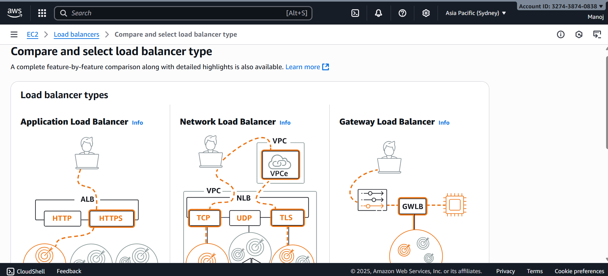

### Actions:
1. In the **Register targets** section
2. Select **both private instances** (the ASG-launched instances)
3. Verify port shows **8000**
4. Click **Include as pending below**
5. Review selected targets in the bottom panel
6. Click **Create target group**

### Target Registration:
- Both instances should appear in the "Review targets" section
- Port: 8000 (ports to pending)
- Status will initially show "initial" then change to "healthy"

### Success Indicators:
- ✅ Target group created successfully
- ✅ 2 targets registered
- ✅ Green success message appears

### Wait Time:
Allow 1-2 minutes for health checks to complete. Targets will transition from "initial" → "healthy".

### Verification:
1. Go to **Target Groups**
2. Select `aws-project-tg`
3. Click **Targets** tab
4. Verify both instances show "healthy" status

---

## STEP 26: Create Load Balancer

**Objective**: Create an internet-facing Application Load Balancer.

Begin creating the Application Load Balancer that will distribute traffic to your instances.

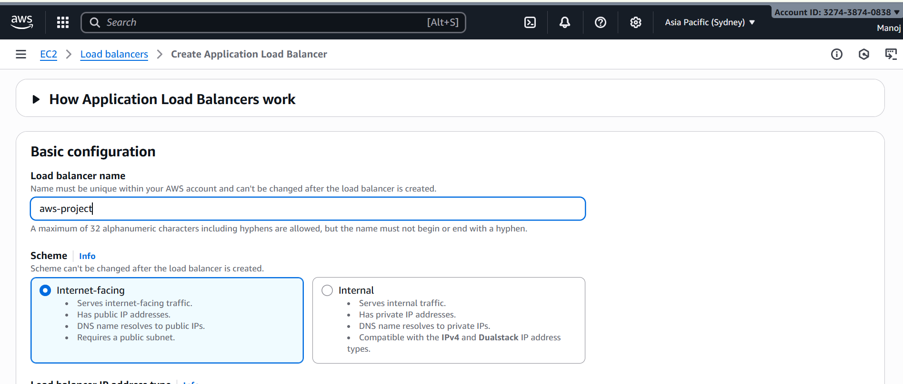

### Navigation:
EC2 Dashboard → Load Balancers → Create Load Balancer

### Load Balancer Types:
- **Application Load Balancer** ← Select this ✅
- Network Load Balancer
- Gateway Load Balancer
- Classic Load Balancer (previous generation)

### Why Application Load Balancer?
- Operates at Layer 7 (HTTP/HTTPS)
- Content-based routing capabilities
- Host-based and path-based routing
- WebSocket support
- Best for web applications
- Advanced request routing

Click **Create** under Application Load Balancer.

---

## STEP 27: Configure Load Balancer

**Objective**: Configure ALB basic settings and network mapping.

Configure the load balancer name, scheme, and network placement across availability zones.

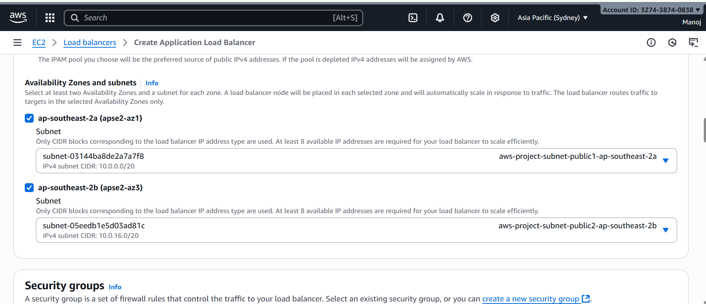

### Basic Configuration:
- **Load balancer name**: `aws-project-alb`
- **Scheme**: Internet-facing ✅
- **IP address type**: IPv4

### Scheme Options:
- **Internet-facing**: ALB has public IP, accessible from internet (select this)
- **Internal**: ALB has private IP, accessible only within VPC

### Network Mapping:
- **VPC**: `aws-project`
- **Mappings**: Select **both Availability Zones**
  - ✅ Availability Zone 1 → **Public Subnet 1**
  - ✅ Availability Zone 2 → **Public Subnet 2**

### Why Public Subnets?
- ALB needs to be accessible from the internet
- Public subnets have routes to Internet Gateway
- ALB will forward traffic to private instances
- Users access via ALB DNS name

### Important:
- ⚠️ ALB must be in at least 2 AZs for high availability
- ⚠️ Both AZ selections are mandatory
- ⚠️ Must select **public subnets**, NOT private subnets

---

## STEP 28: Security Groups and Listener

**Objective**: Configure security and traffic routing for the load balancer.

Configure the security group and listener to allow HTTP traffic and forward to the target group.

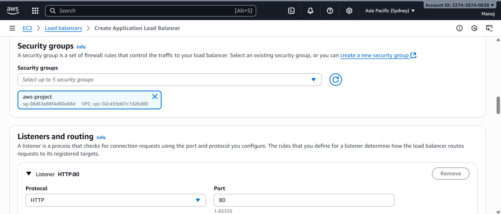

### Security Groups:
- **Select existing** or **create new security group**
- **Security group name**: `aws-project-alb-sg` (if creating new)

### Required Inbound Rule:
- **Type**: HTTP
- **Port**: 80
- **Source**: 0.0.0.0/0 (Anywhere - allows public access)

### Listeners and Routing:
- **Protocol**: HTTP
- **Port**: 80 (standard HTTP port)
- **Default action**: Forward to target group
- **Target group**: `aws-project-tg`

### Listener Configuration:
A listener checks for connection requests from clients using the protocol and port you configure, then forwards requests to the target group.

### Traffic Flow:
1. User accesses ALB DNS on port 80 (HTTP)
2. ALB receives request on listener
3. ALB forwards to target group on port 8000
4. Target group routes to healthy instance
5. Instance processes and responds
6. Response returns through same path

Click **Create load balancer**.

---

## STEP 29: Load Balancer Created

**Objective**: Verify load balancer creation and wait for it to become active.

Wait for the load balancer to be provisioned and become active (takes 2-3 minutes).

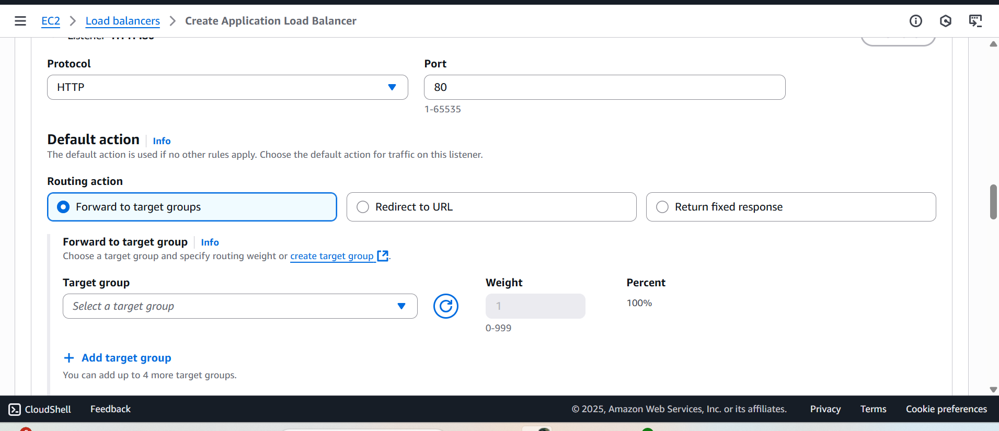

### Success Indicators:
- ✅ Green success message
- ✅ Load balancer appears in list
- ✅ State: Provisioning → Active
- ✅ DNS name generated

### Load Balancer Details:
- **Name**: aws-project-alb
- **DNS name**: aws-project-alb-xxxxxxxxx.region.elb.amazonaws.com
- **State**: Active
- **Type**: application
- **Scheme**: internet-facing
- **Availability Zones**: 2

### Wait Time:
- Initial state: Provisioning (2-3 minutes)
- Final state: Active ✅

### What Happens During Provisioning:
- AWS creates load balancer nodes in each subnet
- Registers DNS name
- Configures listeners and rules
- Establishes connection to target group

Once the state shows "Active", you can proceed to test the application.

---

## STEP 30: Copy DNS Name

**Objective**: Get the load balancer DNS name for accessing the application.

Copy the DNS name of the load balancer to access your application.

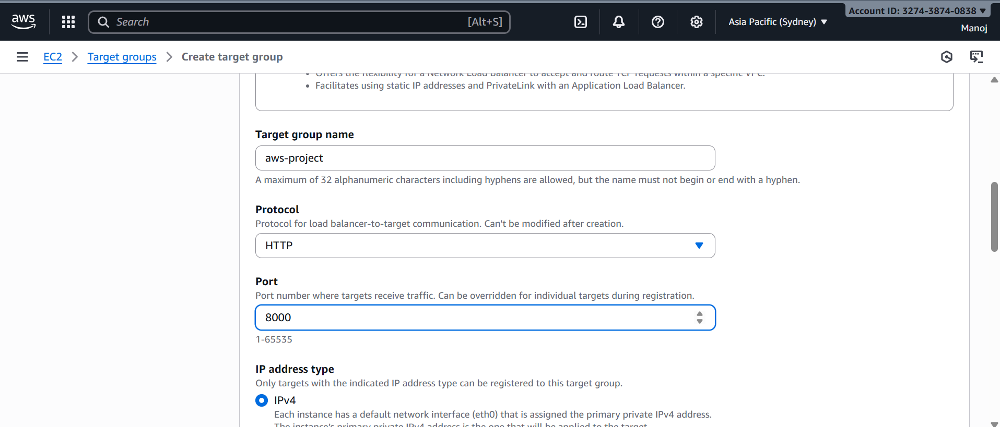

### Actions:
1. Go to **Load Balancers**
2. Select `aws-project-alb`
3. In the **Details** section, find **DNS name**
4. Copy the DNS name

### DNS Format:
```
aws-project-alb-1234567890.us-east-1.elb.amazonaws.com
```

### DNS Name Details:
- Format: `<name>-<random-id>.<region>.elb.amazonaws.com`
- This DNS name is permanent for this load balancer
- Maps to IP addresses of load balancer nodes
- Handles automatic IP updates

### Important:
- ⚠️ Don't use the load balancer's IP addresses directly
- ⚠️ Always use the DNS name
- ⚠️ IP addresses may change; DNS name remains constant

Copy this DNS name to your clipboard - you'll paste it in your browser.

---

## STEP 31: Access Application - Instance 1

**Objective**: Verify application is accessible through the load balancer.

Open your web browser and access the application using the load balancer DNS name.

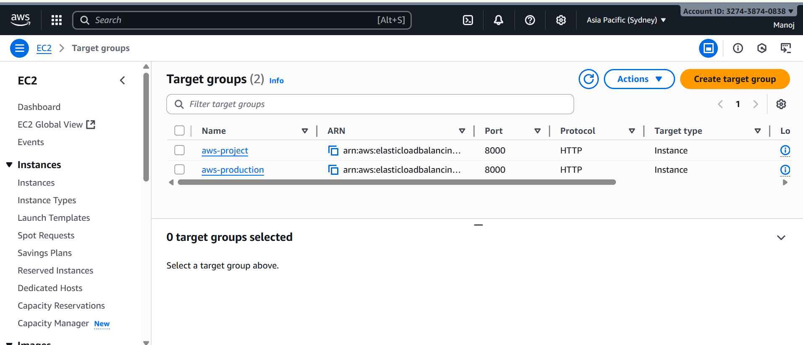

### Actions:
1. Open your web browser (Chrome, Firefox, Safari, Edge)
2. Paste the load balancer DNS name in the address bar
3. Press Enter

### Expected Result:
You should see the HTML page from one of the instances:
```
Welcome to AWS Project!
This is Private Instance 1
```

### What This Proves:
- ✅ Load balancer is working
- ✅ DNS resolution successful
- ✅ Security groups configured correctly
- ✅ Target group routing to instances
- ✅ Instance 1 is healthy and responding
- ✅ Python server running correctly

### URL Format:
```
http://aws-project-alb-1234567890.us-east-1.elb.amazonaws.com
```

---

## STEP 32: Access Application - Instance 2

**Objective**: Verify load balancing by seeing traffic distributed to Instance 2.

Refresh the browser or open a new tab to see the load balancer distribute traffic to Instance 2.

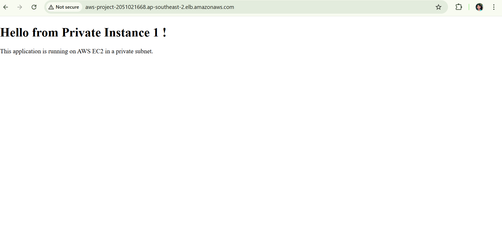

### Actions:
1. **Refresh** the browser (F5 or Ctrl+R)
   OR
2. Open the same URL in a **new tab** or **different browser**

### Expected Result:
You should now see content from Instance 2:
```
Welcome to AWS Project!
This is Private Instance 2
```

### What This Demonstrates:
- ✅ Load balancer distributing traffic (round-robin)
- ✅ Both instances are healthy
- ✅ High availability working
- ✅ Traffic alternating between instances
- ✅ Multi-AZ deployment successful

### Load Balancing Algorithm:
The ALB uses round-robin by default:
- First request → Instance 1
- Second request → Instance 2
- Third request → Instance 1
- And so on...

### Testing Tips:
- Refresh multiple times to see both instances
- Try from different browsers
- Use incognito/private mode
- Each new session may route to different instance

---

## STEP 33: Verify in MobaXterm

**Objective**: View the active SSH sessions and server logs.

Check your MobaXterm sessions to see the Python servers running on both instances.

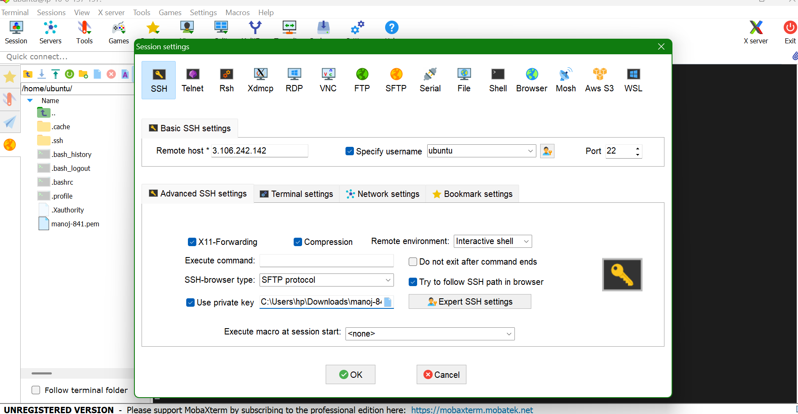

### What You'll See:
In your MobaXterm windows, the Python servers will show access logs:

**Instance 1 Terminal**:
```
Serving HTTP on 0.0.0.0 port 8000 ...
10.0.0.x - - [21/Oct/2024 10:30:15] "GET / HTTP/1.1" 200 -
10.0.0.x - - [21/Oct/2024 10:30:45] "GET / HTTP/1.1" 200 -
```

**Instance 2 Terminal**:
```
Serving HTTP on 0.0.0.0 port 8000 ...
10.0.1.x - - [21/Oct/2024 10:31:20] "GET / HTTP/1.1" 200 -
10.0.1.x - - [21/Oct/2024 10:31:55] "GET / HTTP/1.1" 200 -
```

### Log Breakdown:
- `10.0.0.x` or `10.0.1.x`: Load balancer's private IP
- `GET / HTTP/1.1`: HTTP GET request
- `200`: HTTP status code (success)
- Timestamps show when requests arrived

### What This Shows:
- ✅ Both servers actively receiving requests
- ✅ Load balancer forwarding traffic to both instances
- ✅ Requests coming from load balancer IPs (not public internet)
- ✅ Architecture working as designed

---

## STEP 34: Bastion Host Details

**Objective**: Review bastion host configuration and SSH settings.

View the bastion host instance details and MobaXterm SSH configuration.

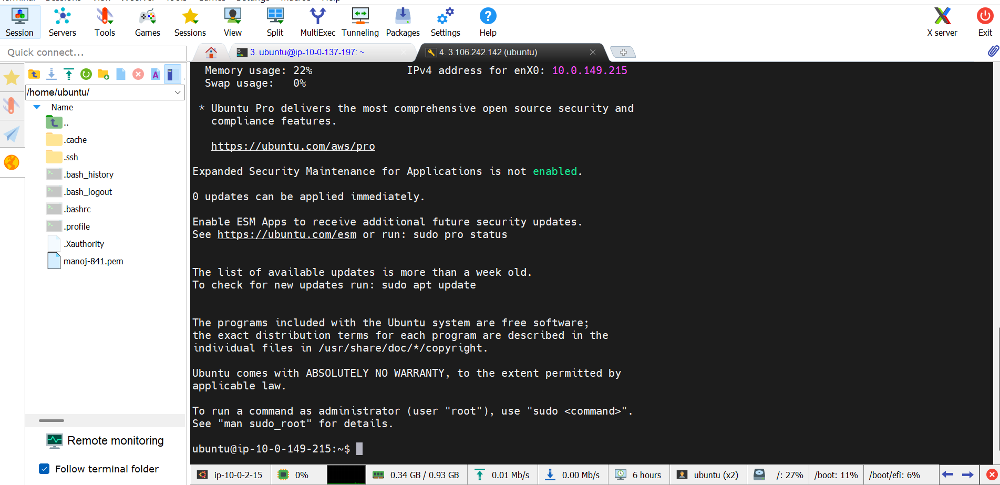

### Bastion Host Details:
- **Instance ID**: i-xxxxxxxxxxxxxxxxx
- **Public IPv4 address**: 54.x.x.x (accessible from internet)
- **Private IPv4 address**: 10.0.0.x
- **Instance state**: Running
- **Instance type**: t2.micro
- **Availability Zone**: us-east-1a (or your AZ)
- **VPC**: aws-project
- **Subnet**: Public Subnet 1
- **Security groups**: bastion-sg

### SSH Configuration in MobaXterm:
- **Remote host**: Bastion public IP
- **Username**: ubuntu
- **Port**: 22
- **Private key**: Path to manoj-841.pem

### Connection Path:
```
Your Computer → Bastion Host (Public IP) → Private Instances (Private IPs)
```

### Security Benefits:
- Single point of entry to private network
- Reduces attack surface
- Centralized access control
- Audit trail of connections
- Can be easily monitored and secured

---

## STEP 35: Final Verification

**Objective**: Final comprehensive test showing load balancing across multiple browsers.

Perform final verification by accessing the application from multiple browsers to confirm load balancing.

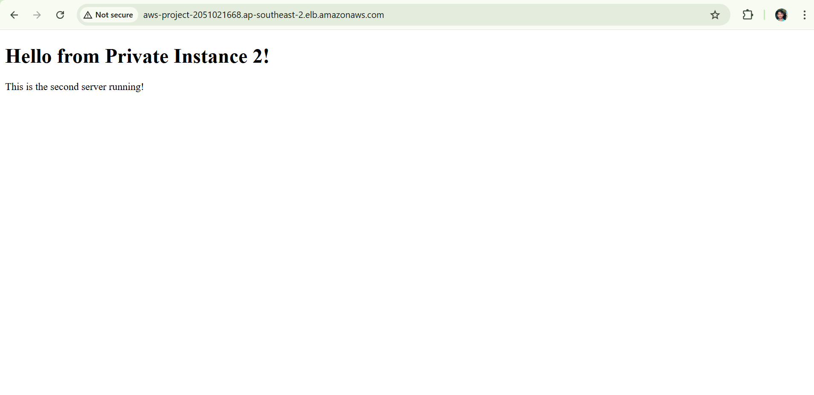

### Final Test:
**Open multiple browsers or tabs simultaneously**:
1. Chrome → Load balancer DNS
2. Firefox → Load balancer DNS
3. Edge → Load balancer DNS
4. Multiple tabs in same browser

### Expected Results:
Different browsers/sessions will show different instances:
- Some show: "This is Private Instance 1"
- Others show: "This is Private Instance 2"

### What This Proves:
- ✅ Load balancer distributing traffic across instances
- ✅ Both instances healthy and responding
- ✅ High availability architecture working
- ✅ Multi-AZ deployment successful
- ✅ Auto Scaling Group managing instances correctly
- ✅ Security groups properly configured
- ✅ NAT Gateways enabling internet access
- ✅ Bastion host providing secure access
- ✅ Complete architecture functioning as designed

### Architecture Success Indicators:
- ✅ VPC with public and private subnets
- ✅ Two availability zones
- ✅ Application Load Balancer active
- ✅ Target group with 2 healthy targets
- ✅ Auto Scaling Group maintaining desired capacity
- ✅ Instances in private subnets (no public IPs)
- ✅ Bastion host for secure access
- ✅ Python applications serving content
- ✅ Load balancing confirmed

**🎉 Congratulations! Your AWS multi-tier architecture is fully deployed and operational!**

---

## Key Concepts Learned

Throughout this project, you've learned and implemented several key AWS concepts and best practices:

### 1. **Virtual Private Cloud (VPC)**
- Created custom VPC with isolated network
- Configured CIDR blocks for IP addressing
- Implemented network segmentation
- **Key Takeaway**: VPCs provide complete network isolation and control

### 2. **Multi-AZ Architecture**
- Deployed resources across two availability zones
- Ensured high availability and fault tolerance
- Implemented redundancy for critical components
- **Key Takeaway**: Multi-AZ deployment protects against datacenter failures

### 3. **Public vs Private Subnets**
- Public subnets for internet-facing resources (ALB, Bastion)
- Private subnets for application instances (security)
- Proper subnet design for security layers
- **Key Takeaway**: Network segmentation is crucial for security

### 4. **NAT Gateway**
- Enabled outbound internet for private instances
- Maintained security by preventing inbound access
- Deployed one per AZ for high availability
- **Key Takeaway**: NAT Gateways allow secure internet access from private subnets

### 5. **Security Groups (Firewalls)**
- Configured stateful firewall rules
- Implemented least privilege access
- Separated security groups for different tiers
- **Key Takeaway**: Security groups are the first line of defense

### 6. **Bastion Host (Jump Server)**
- Implemented secure SSH access pattern
- Single entry point to private network
- Reduced attack surface
- **Key Takeaway**: Bastion hosts provide secure administrative access

### 7. **Application Load Balancer**
- Distributed traffic across multiple instances
- Performed health checks on targets
- Operated at Layer 7 (HTTP/HTTPS)
- **Key Takeaway**: Load balancers ensure high availability and distribute load

### 8. **Auto Scaling Groups**
- Automated instance management
- Maintained desired capacity
- Enabled horizontal scaling
- **Key Takeaway**: Auto Scaling ensures application availability and optimizes costs

### 9. **Target Groups**
- Grouped instances for load balancing
- Performed health checks
- Routed traffic to healthy instances only
- **Key Takeaway**: Target groups manage backend resources efficiently

### 10. **High Availability Design**
- Multi-AZ deployment
- Load balancing across zones
- Automatic failover capabilities
- **Key Takeaway**: Proper architecture design prevents single points of failure

### 11. **Infrastructure as Code Concepts**
- Launch templates for consistency
- Repeatable deployments
- Version control for configurations
- **Key Takeaway**: Templates ensure consistent infrastructure

### 12. **Cloud Security Best Practices**
- Network isolation with VPCs
- Defense in depth with security layers
- Principle of least privilege
- Secure access patterns
- **Key Takeaway**: Security should be implemented at every layer

---

## Troubleshooting Guide

Common issues and their solutions:

### Issue 1: Cannot Connect to Bastion Host
**Symptoms**: 
- SSH connection timeout
- Connection refused error

**Solutions**:
1. ✅ **Check Security Group**:
   - Verify bastion-sg allows SSH (port 22) from your IP
   - Update your IP if it changed: `My IP → Current IP`

2. ✅ **Verify Instance State**:
   - Ensure bastion host is "Running"
   - Check status checks are passing

3. ✅ **Check Public IP**:
   - Verify bastion has public IP assigned
   - Confirm you're using correct public IP

4. ✅ **PEM File Permissions**:
   ```bash
   chmod 400 manoj-841.pem
   ```

5. ✅ **Network Configuration**:
   - Verify bastion is in public subnet
   - Check Internet Gateway is attached
   - Verify route table has 0.0.0.0/0 → IGW

---

### Issue 2: Cannot SSH to Private Instances from Bastion
**Symptoms**:
- Connection timeout from bastion to private instance
- No route to host error

**Solutions**:
1. ✅ **PEM File Transfer**:
   - Ensure PEM file is on bastion host
   - Verify permissions: `chmod 400 manoj-841.pem`

2. ✅ **Security Groups**:
   - Check private instance security group allows SSH from bastion
   - Add rule: SSH (22) from bastion security group

3. ✅ **Use Private IP**:
   - Always use private IP address, not public IP
   - Verify IP from EC2 console

4. ✅ **Network Connectivity**:
   - Ensure both instances in same VPC
   - Verify route tables configured correctly

---

### Issue 3: Python Server Not Starting
**Symptoms**:
- Port already in use
- Permission denied

**Solutions**:
1. ✅ **Port Already in Use**:
   ```bash
   # Kill existing process
   sudo lsof -t -i:8000 | xargs kill -9
   # Or use different port
   python3 -m http.server 8001
   ```

2. ✅ **Python Not Installed**:
   ```bash
   sudo apt update
   sudo apt install python3 -y
   ```

3. ✅ **File Not Found**:
   ```bash
   # Verify index.html exists
   ls -la index.html
   # Verify you're in correct directory
   pwd
   ```

---

### Issue 4: Cannot Access Application via Load Balancer
**Symptoms**:
- 502 Bad Gateway error
- 504 Gateway Timeout
- Connection refused

**Solutions**:
1. ✅ **Check Target Health**:
   - Go to Target Groups → aws-project-tg → Targets tab
   - Ensure both targets show "healthy"
   - If unhealthy, check security groups and Python servers

2. ✅ **Security Groups**:
   - ALB security group: Allow HTTP (80) from 0.0.0.0/0
   - Instance security group: Allow port 8000 from ALB security group

3. ✅ **Python Servers Running**:
   ```bash
   # On each instance, verify server is running
   ps aux | grep python
   # Should show: python3 -m http.server 8000
   ```

4. ✅ **Load Balancer State**:
   - Verify ALB state is "Active"
   - Check listener is configured: HTTP:80 → aws-project-tg

5. ✅ **DNS Propagation**:
   - Wait 2-3 minutes after ALB creation
   - Try accessing directly by IP if DNS not resolving

---

### Issue 5: Target Group Shows Unhealthy Targets
**Symptoms**:
- Targets remain in "unhealthy" state
- Health checks failing

**Solutions**:
1. ✅ **Python Server Running**:
   ```bash
   # On instance, check if server is running
   python3 -m http.server 8000
   ```

2. ✅ **Security Group Rules**:
   - Instance security group must allow port 8000 from ALB security group
   - Add inbound rule: Custom TCP, Port 8000, Source: ALB security group

3. ✅ **Health Check Path**:
   - Verify health check path is `/`
   - Ensure index.html exists in current directory

4. ✅ **Health Check Settings**:
   - Check timeout and interval settings
   - Default: 30-second interval, 5-second timeout

---

### Issue 6: Load Balancer Always Shows Same Instance
**Symptoms**:
- Always see "Instance 1" or always "Instance 2"
- Load balancing not working

**Solutions**:
1. ✅ **Clear Browser Cache**:
   - Press Ctrl+Shift+Delete
   - Clear cache and cookies
   - Try incognito/private mode

2. ✅ **Check Both Targets Healthy**:
   - Go to Target Groups → Targets
   - Both should show "healthy"

3. ✅ **Session Stickiness**:
   - Go to Target Group → Attributes
   - Ensure stickiness is disabled (for testing)

4. ✅ **Try Different Methods**:
   - Use curl: `curl http://alb-dns-name`
   - Try different browsers
   - Open multiple new tabs

---

### Issue 7: Auto Scaling Not Launching Instances
**Symptoms**:
- Desired capacity not met
- Instances not launching

**Solutions**:
1. ✅ **Check ASG Status**:
   - Go to Auto Scaling Groups → aws-project
   - Check Activity tab for errors

2. ✅ **Launch Template**:
   - Verify launch template is valid
   - Check AMI still available
   - Verify subnet configuration

3. ✅ **Service Quotas**:
   - Check EC2 instance limits
   - Verify you haven't reached quota

4. ✅ **Subnet Capacity**:
   - Ensure subnets have available IP addresses

---

### Issue 8: NAT Gateway Not Working
**Symptoms**:
- Private instances can't access internet
- Package installation fails

**Solutions**:
1. ✅ **NAT Gateway State**:
   - Go to VPC → NAT Gateways
   - Verify state is "Available"

2. ✅ **Elastic IP**:
   - Ensure NAT Gateway has Elastic IP associated

3. ✅ **Route Tables**:
   - Check private subnet route table
   - Verify route: 0.0.0.0/0 → NAT Gateway
   - Ensure route table associated with private subnets

4. ✅ **Test Connectivity**:
   ```bash
   # On private instance
   ping 8.8.8.8
   curl http://example.com
   ```

---

### Issue 9: High AWS Costs
**Symptoms**:
- Unexpected charges
- Bills higher than expected

**Solutions**:
1. ✅ **NAT Gateway Costs**:
   - NAT Gateways charge per hour + data processing
   - Consider using single NAT Gateway for cost savings (non-production)

2. ✅ **Running Instances**:
   - Stop instances when not in use
   - Use Auto Scaling to reduce to minimum capacity

3. ✅ **Load Balancer**:
   - ALB charges per hour + LCU (Load Balancer Capacity Units)
   - Delete when not needed

4. ✅ **Elastic IPs**:
   - Release unused Elastic IPs
   - Elastic IPs charge when not associated

**Cost Optimization Tips**:
- Use t2.micro (free tier eligible)
- Stop/terminate resources when not needed
- Use AWS Cost Explorer to monitor costs
- Set up billing alerts

---

### General Troubleshooting Commands

**Check Instance Connectivity**:
```bash
# Ping test (won't work if ICMP blocked)
ping <ip-address>

# Test specific port
telnet <ip-address> 8000
# or
nc -zv <ip-address> 8000
```

**View Running Processes**:
```bash
# Check if Python server running
ps aux | grep python

# Check what's using port 8000
sudo lsof -i :8000

# View all network connections
netstat -tulpn
```

**Check Network Configuration**:
```bash
# View IP configuration
ip addr show

# View routing table
ip route show

# Check DNS resolution
nslookup aws-project-alb-xxx.elb.amazonaws.com
```

**View System Logs**:
```bash
# System logs
sudo tail -f /var/log/syslog

# Cloud-init logs
sudo cat /var/log/cloud-init-output.log
```

---

## Conclusion

### Project Summary

Congratulations on completing this comprehensive AWS deployment project! You've successfully built a production-ready, scalable, and highly-available web application infrastructure on AWS.

### What You've Accomplished:

1. ✅ **Network Architecture**:
   - Created a custom VPC with public and private subnets
   - Configured multi-AZ deployment across two availability zones
   - Implemented proper network segmentation for security

2. ✅ **High Availability**:
   - Deployed Application Load Balancer for traffic distribution
   - Configured Auto Scaling Group for automatic capacity management
   - Ensured redundancy with multi-AZ architecture

3. ✅ **Security**:
   - Implemented bastion host for secure administrative access
   - Configured security groups for layered defense
   - Placed application instances in private subnets
   - Used NAT Gateways for controlled internet access

4. ✅ **Application Deployment**:
   - Deployed Python web application on multiple instances
   - Verified load balancing functionality
   - Tested high availability and failover

### Skills Gained:

- 🎯 AWS VPC design and implementation
- 🎯 Load balancer configuration and management
- 🎯 Auto Scaling Group setup and configuration
- 🎯 Security group design and implementation
- 🎯 Multi-tier architecture design
- 🎯 Linux server administration
- 🎯 SSH and secure access patterns
- 🎯 Web application deployment
- 🎯 Troubleshooting and problem-solving

### Real-World Applications:

This architecture pattern is used by companies worldwide for:
- E-commerce websites
- Content management systems
- API backends
- Web applications
- Mobile app backends
- Microservices architectures

### Best Practices Implemented:

- ✅ **High Availability**: Multi-AZ deployment
- ✅ **Scalability**: Auto Scaling for demand changes
- ✅ **Security**: Defense in depth with multiple layers
- ✅ **Cost Optimization**: Right-sizing with t2.micro
- ✅ **Monitoring**: Health checks and target group monitoring
- ✅ **Maintainability**: Launch templates for consistency

### Next Steps for Production:

To make this production-ready, consider:

1. **Security Enhancements**:
   - Enable HTTPS with SSL/TLS certificates (AWS Certificate Manager)
   - Implement Web Application Firewall (AWS WAF)
   - Enable VPC Flow Logs for network monitoring
   - Use Systems Manager Session Manager instead of bastion

2. **Monitoring and Logging**:
   - Set up CloudWatch alarms for critical metrics
   - Enable ALB access logs
   - Implement application-level logging
   - Use CloudTrail for API auditing

3. **Backup and Disaster Recovery**:
   - Enable automated EBS snapshots
   - Implement cross-region replication
   - Document recovery procedures
   - Test failover scenarios

4. **Performance Optimization**:
   - Use CloudFront CDN for static content
   - Implement caching strategies
   - Optimize database queries (if using RDS)
   - Enable ALB sticky sessions if needed

5. **Cost Optimization**:
   - Use Reserved Instances or Savings Plans
   - Implement Auto Scaling policies based on metrics
   - Right-size instances based on actual usage
   - Use Spot Instances for non-critical workloads
## Author
   - Gaddam Manoj Kumar Reddy Date: October 21, 2025
   - Project: AWS Application Deployment using Public and Private Subnets

## License
   - This project is for educational purposes.
