# Jenkins Deployment on AWS EC2 - Complete Guide

## Project Overview

This guide provides a comprehensive walkthrough for deploying Jenkins on an AWS EC2 instance. Jenkins is an open-source automation server used for continuous integration and continuous deployment (CI/CD). By the end of this project, you'll have a fully functional Jenkins server running on AWS that can be used to deploy applications.

---

## Prerequisites

Before starting this project, ensure you have:
- An AWS account with appropriate permissions
- Basic knowledge of Linux/Ubuntu
- MobaXterm or similar SSH client installed
- Internet connectivity

---

## Step 1: Create an EC2 Instance

The first step is to launch an EC2 instance, which provides you with a virtual machine with elastic (scalable) resources.

**Actions:**
1. Log in to your AWS Management Console
2. Navigate to the EC2 Dashboard
3. Click on "Launch Instances"
4. Choose a name for your instance (e.g., "Jenkins-Server")
5. Click "Launch Instance"

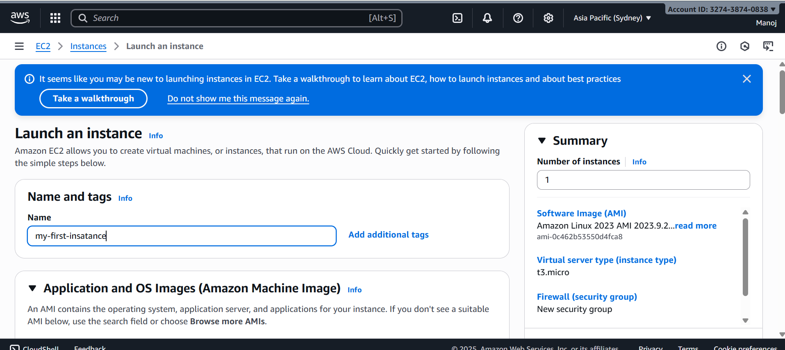

---

## Step 2: Select the Operating System

Choosing the right OS is crucial for your Jenkins deployment.

**Actions:**
1. In the AMI (Amazon Machine Image) selection, search for "Ubuntu"
2. Select **Ubuntu Server 20.04 LTS** or the latest LTS version available
3. This free-tier eligible option is ideal for learning and small deployments

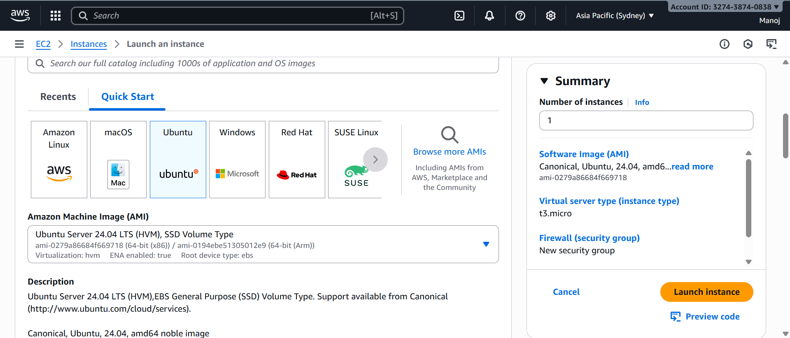

---

## Step 3: Choose the Instance Type

The instance type determines the computational power of your virtual machine.

**Actions:**
1. In the Instance Type section, select **t2.micro**
2. This type is eligible for AWS free tier and is suitable for Jenkins development/testing
3. Note: For production environments, consider compute-optimized (c5, c6), memory-optimized (r5, r6), or storage-optimized (i3, i4) instance types

**Instance Types Overview:**
- **General Purpose (t2, t3):** Balanced compute, memory, and networking
- **Compute Optimized (c5, c6):** High-performance processors for batch processing
- **Memory Optimized (r5, r6, x1):** Large datasets and in-memory caches
- **Storage Optimized (i3, i4):** High sequential I/O access to large datasets

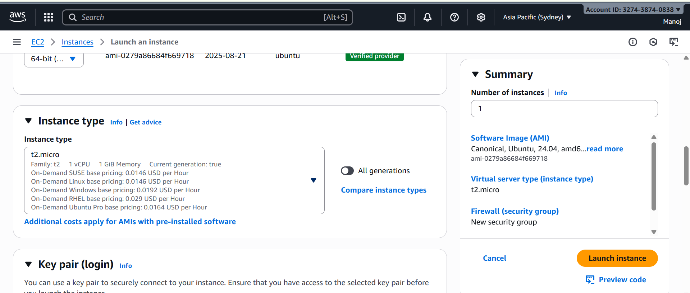

---

## Step 4: Create and Download the Key Pair

The key pair is essential for secure SSH access to your instance.

**Actions:**
1. In the Network Settings section, under "Key Pair," click "Create new key pair"
2. Enter a name for your key pair (e.g., "jenkins-key")
3. Ensure the file format is **PEM**
4. Click "Create key pair" — the .pem file will automatically download
5. **Important:** Store this file in a secure location; you'll need it to connect to your instance

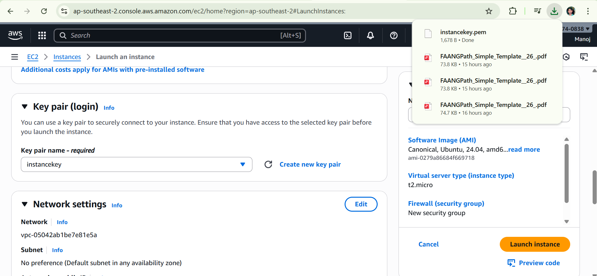

---

## Step 5: Successfully Created Instance

After completing all configurations, launch your instance.

**Actions:**
1. Review all your settings
2. Click "Launch Instance"
3. Wait for the instance to transition from "Pending" to "Running" state
4. Refresh the EC2 Dashboard to see your new instance

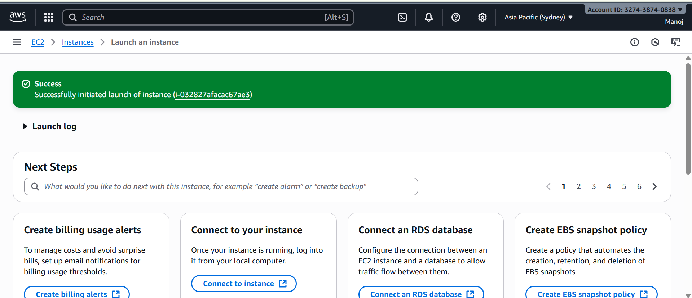

---

## Step 6: View Instance Dashboard

The instance dashboard displays critical information about your running instance.

**What You'll See:**
- **Instance ID:** Unique identifier for your instance
- **Public IP Address:** Used to connect to the instance from the internet
- **Private IP Address:** Used for internal AWS communication
- **Instance State:** Shows whether the instance is running, stopped, or terminated
- **Availability Zone:** Geographic location of your instance

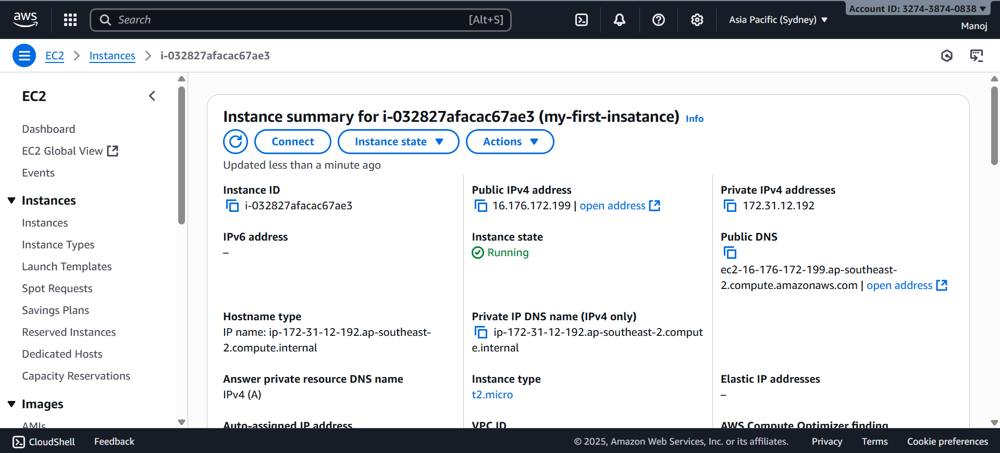

---

## Step 7: Configure Security Groups and Inbound Rules

Security groups act as firewalls controlling traffic to your instance.

**Actions:**
1. In the EC2 Dashboard, select your instance
2. Go to the "Security" tab
3. Click on the security group name
4. Click "Edit inbound rules"
5. Add a new rule:
   - **Type:** Custom TCP Rule
   - **Protocol:** TCP
   - **Port Range:** 8080 (Jenkins default port)
   - **Source:** 0.0.0.0/0 (Allow from anywhere) or your specific IP for security
6. Also add HTTP (port 80) and HTTPS (port 443) if needed
7. Click "Save rules"

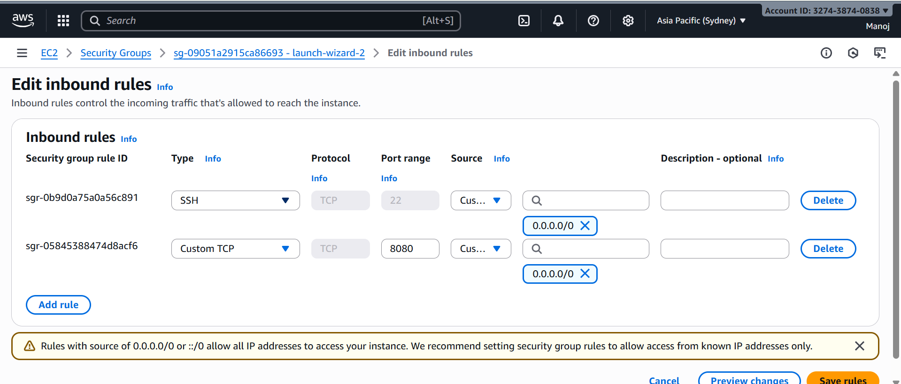

---

## Step 8: Install MobaXterm and Connect to Instance

MobaXterm is an advanced terminal emulator for Windows with built-in SSH client.

**Actions:**
1. Download and install MobaXterm from https://mobaxterm.mobatek.net/
2. Open MobaXterm
3. Click "Session" in the top menu
4. Select "SSH"
5. Enter the following details:
   - **Remote Host:** Your instance's public IP address
   - **Username:** ubuntu
   - **Advanced Settings:** Check "Use private key" and browse to select your downloaded .pem file
6. Click "OK"

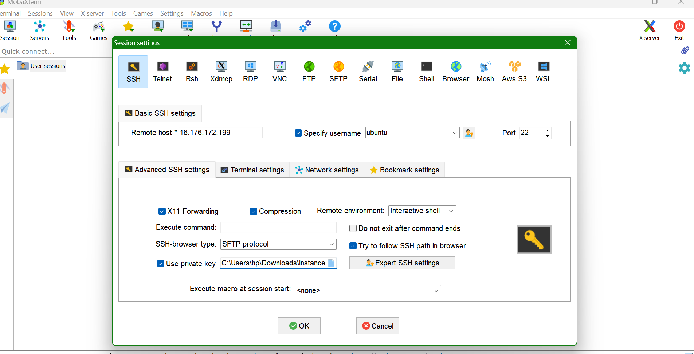

---

## Step 9: Successfully Connected Terminal

Upon successful connection, you'll see the Ubuntu terminal prompt.

**Actions:**
1. Wait for the connection to establish
2. You should see the terminal showing something like: `ubuntu@ip-xxx-xxx-xxx-xxx:~$`
3. This confirms you've successfully accessed your EC2 instance

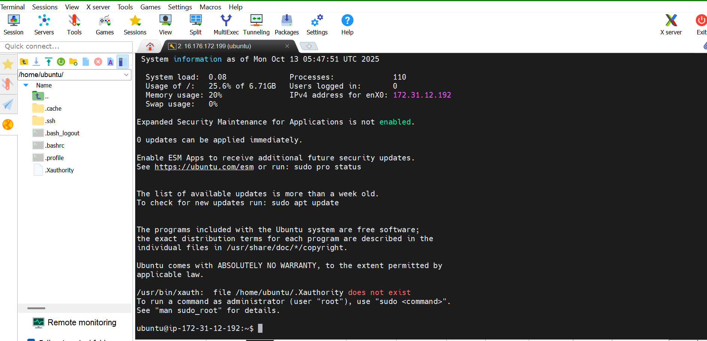

---

## Step 10: Check if Java is Installed

Jenkins requires Java to run. Check if it's already installed on your Ubuntu instance.

**Command:**
```bash
java -version
```

**Expected Output (if installed):**
```
openjdk version "11.0.x" 2021-xx-xx
OpenJDK Runtime Environment (build 11.0.x+x-post-Ubuntu)
```

**If Java is not installed**, proceed to Step 11.

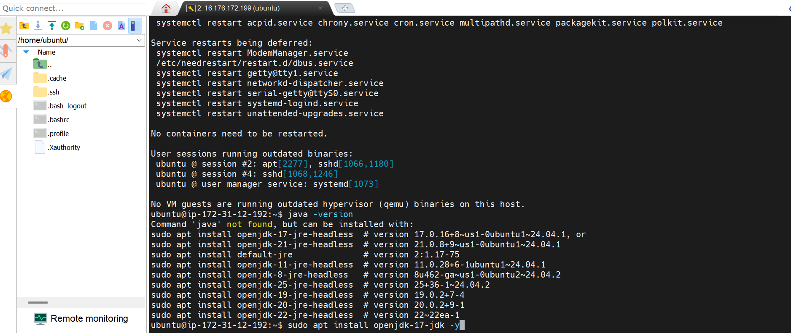

---

## Step 11: Install Java

Since Jenkins requires Java, install it if it's not already present.

**Commands:**
```bash
sudo apt update
sudo apt install openjdk-11-jdk -y
java -version
```

**What This Does:**
- `sudo apt update` — Updates package lists
- `sudo apt install openjdk-11-jdk -y` — Installs OpenJDK 11 (Java Development Kit)
- `java -version` — Verifies the installation and displays the version

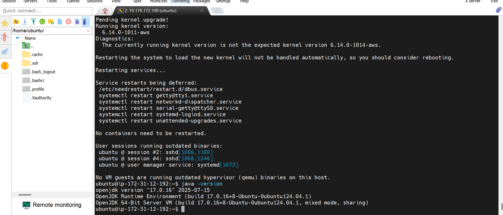

---

## Step 12: Update Ubuntu and Install Jenkins

Before installing Jenkins, update your system packages, then install Jenkins using the official Jenkins repository.

**Commands:**
```bash
sudo apt update
sudo apt upgrade -y
curl -fsSL https://pkg.jenkins.io/debian-stable/jenkins.io.key | sudo tee /usr/share/keyrings/jenkins-keyring.asc > /dev/null
echo deb [signed-by=/usr/share/keyrings/jenkins-keyring.asc] https://pkg.jenkins.io/debian-stable binary/ | sudo tee /etc/apt/sources.list.d/jenkins.list > /dev/null
sudo apt-get update
sudo apt-get install jenkins -y
sudo systemctl start jenkins
sudo systemctl enable jenkins
```

**What This Does:**
- Adds the Jenkins official repository to your system
- Installs Jenkins
- Starts the Jenkins service
- Enables Jenkins to start automatically on instance reboot

**Retrieve the Jenkins Admin Password:**
```bash
sudo cat /var/lib/jenkins/secrets/initialAdminPassword
```

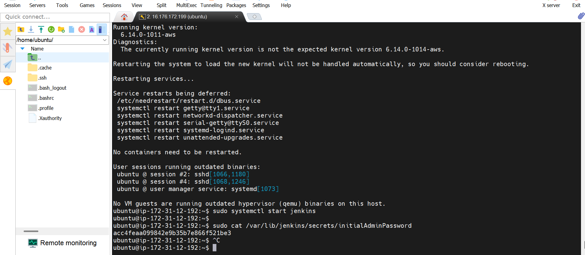

---

## Step 13: Access Jenkins Web Interface

Now that Jenkins is installed and running, access it through your web browser.

**Actions:**
1. Open your web browser
2. Navigate to: `https://YOUR-PUBLIC-IP-ADDRESS:8080`
   - Replace YOUR-PUBLIC-IP-ADDRESS with your instance's public IP
3. You'll see the Jenkins unlock page
4. Paste the admin password obtained from Step 12
5. Click "Continue"
6. Follow the setup wizard to:
   - Install suggested plugins
   - Create an admin user
   - Configure Jenkins URL
   - Start using Jenkins

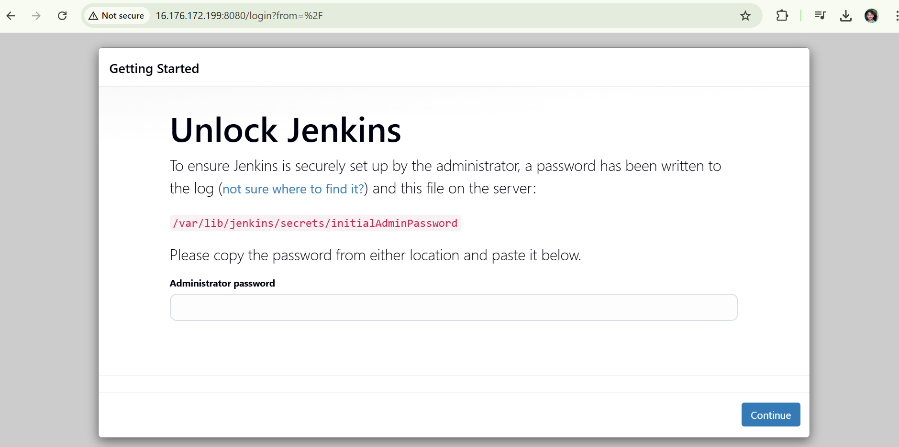

---

## Step 14: Deploy Application Using Jenkins

With Jenkins fully set up, you can now create jobs and deploy applications.

**Basic Deployment Steps:**
1. On the Jenkins Dashboard, click "Create a Job"
2. Enter a job name and select "Freestyle project"
3. Configure the job:
   - **Source Code Management:** Add your Git repository URL
   - **Build Triggers:** Set how the job should be triggered
   - **Build Steps:** Add shell commands to build and deploy your application
4. Click "Build Now" to run the job
5. Monitor the build progress in the "Build History"
6. View logs by clicking on the build number

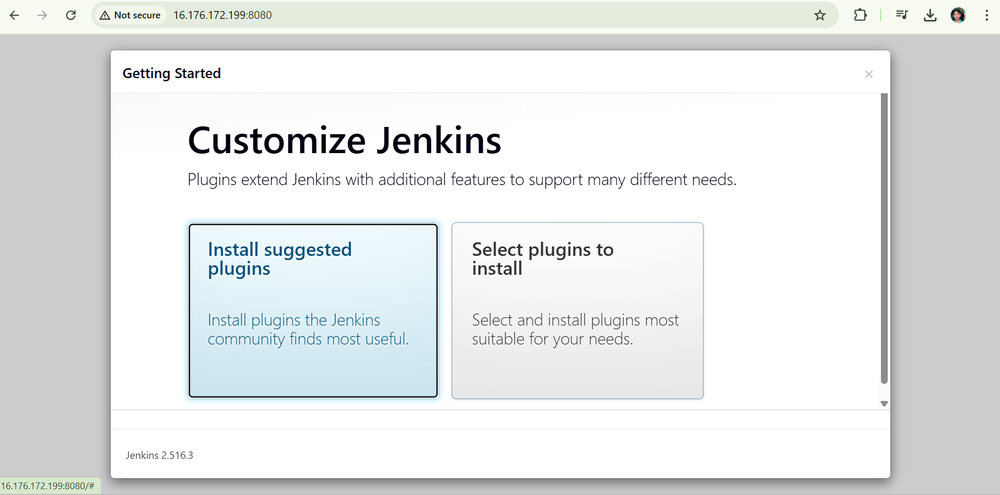

---

## EC2 Instance Types Summary

For future reference, here are the main EC2 instance types:

**General Purpose (t2, t3, m5, m6):** Best for web servers and small databases — balanced compute, memory, and networking.

**Compute Optimized (c5, c6):** Best for high-performance processors — ideal for batch processing, media encoding, and scientific simulations.

**Memory Optimized (r5, r6, x1):** Best for in-memory databases and caches — supports large datasets in RAM.

**Storage Optimized (i3, i4, h1):** Best for high I/O operations — ideal for NoSQL databases and data warehousing.

**GPU Instances (p3, g4):** Best for machine learning and graphics-intensive applications.

---

## Troubleshooting

**Connection Issues:**
- Verify your security group allows SSH on port 22
- Ensure your .pem file has correct permissions: `chmod 400 jenkins-key.pem`
- Check that your instance is in "Running" state

**Jenkins Not Accessible:**
- Verify port 8080 is open in security group inbound rules
- Check Jenkins service status: `sudo systemctl status jenkins`
- Restart Jenkins: `sudo systemctl restart jenkins`

**Java Not Found:**
- Reinstall Java: `sudo apt install openjdk-11-jdk -y`

---

## Conclusion

Congratulations! You've successfully deployed Jenkins on AWS EC2. You now have a functional CI/CD platform that can automate your application deployments. This setup provides a solid foundation for building continuous integration and continuous deployment pipelines.

For more information, visit:
- [Jenkins Documentation](https://www.jenkins.io/doc/)
- [AWS EC2 Documentation](https://docs.aws.amazon.com/ec2/)

---

## Notes

- Keep your .pem file secure and never share it
- Regularly back up your Jenkins configurations
- Monitor your AWS billing to avoid unexpected charges
- Update Jenkins and system packages regularly for security patches
